# NANDA 2.0 :** 실μµμ© μ „μκ°„νΈκΈ°λ΅μ‹μ¤ν… LLM μ μ© / μ „μκ°„νΈκΈ°λ΅ 문구 μ‘λ™ μ‘μ„± μ‹μ¤ν… 

π€ν€μ¥ : ν™©μ¬μ—°

βοΈν€μ› : μ•μ§€μ€, ν™μ„Έν—, λ°•μ•„μ

π—„οΈRepository : [https://github.com/SmartNurse/Year_Dream](https://github.com/SmartNurse/Year_Dream)

---

- **λ©μ°¨**
    1. [ν”„λ΅μ νΈ κ°μ”]
    2. [λ°μ΄ν„° EDA]
        1. λ°μ΄ν„° ν„ν™©
        2. 1μ°¨ μ „μ²λ¦¬
        3. 2μ°¨ μ „μ²λ¦¬
        4. LLM ν•™μµ λ°μ΄ν„°μ…‹ μ μ‘
    3. [Model : Fine-tuning & LLM ν•™μµ]
        1. GPT API : Microsoft Azure Open AI
        2. GPT Fine-tuning
        3. LLM ν•™μµ
    4. [μ„λΉ„μ¤ κµ¬ν„ λ° λ°°ν¬]
        1. Chatbot : Langchain 
        2. Webapp deployment : Streamlit 


    

# 1. ν”„λ΅μ νΈ **κ°μ”**

β¨ν”„λ΅μ νΈ ν•„μ”μ„± (λ¬Έμ  μ μ‹)

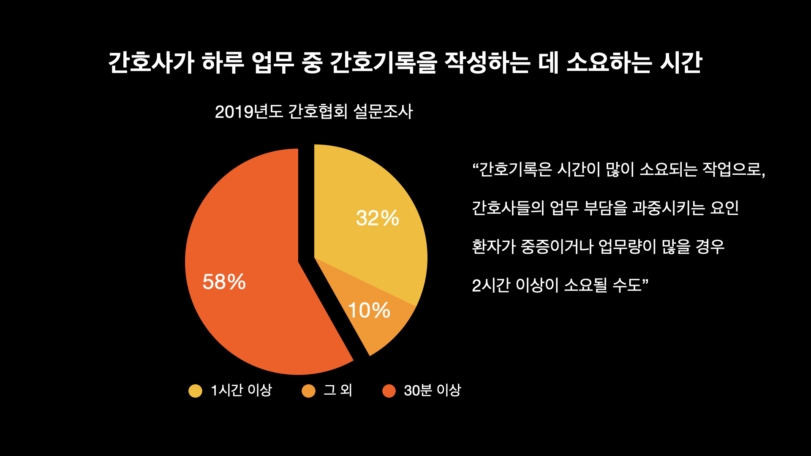

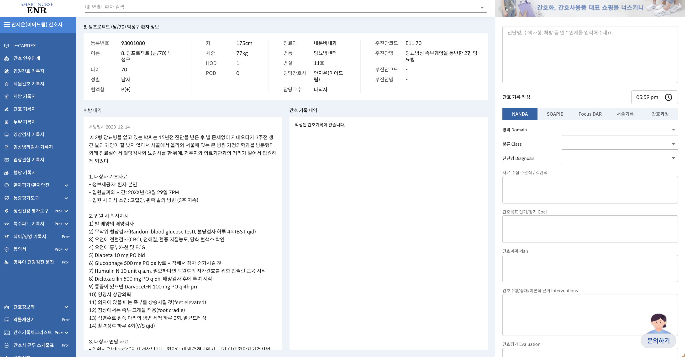

κ°„νΈλ€ν•™μƒ λ° μ‹ κ·κ°„νΈμ‚¬λ¥Ό μ„ν• DK Medi Info μ Smart Nurse ENR μ‹μ¤ν…

### **β¨ν”„λ΅μ νΈ λ©ν‘**

- μ „μ κ°„νΈκΈ°λ΅ λ°μ΄ν„° κΈ°λ° μ‹¤μµμ© μ „μ κ°„νΈκΈ°λ΅ 문구 μλ™ μƒμ„± 챗봇 μ‹μ¤ν… 구ν„

### β¨Work Flow

- **λ°μ΄ν„° μ „μ²λ¦¬ β†’ LLM λ¨λΈ Fine-tuning  β†’ Prompt fine-tuning β†’ 챗봇 μ„λΉ„μ¤ κµ¬ν„ β†’ μ›Ήμ•± λ°°ν¬**
    
    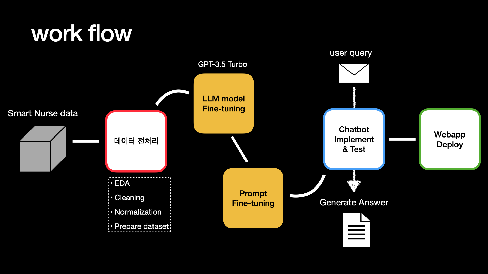
    
    work flow
    

### β¨μ‚¬μ©ν• ν΄

- GPT-3.5 turbo (Azure Open AI) : Pretrained LLM Model
- (ν•μ΄νΌν΄λ΅λ°”X) : Pretrained LLM Model
- Langchain : Chatbot implementation
- Streamlit : Webapp deployment

### β¨Β μ©μ–΄ 설λ…

- μ¤λ§νΈλ„μ¤μ—μ„ μ κ³µν•λ” μ£Όμ” κ°„νΈκΈ°λ΅ μ–‘μ‹
    - NANDA : λ¶λ―Έ κ°„νΈν‘ν ν‘준 μ§„λ‹¨μ΄ ν¬ν•¨λ κΈ°λ΅ μ²΄κ³„
        - [domain, class, diagnosis, μλ£, κ°„νΈ λ©ν‘, κ°„νΈ κ³„ν] λ“± ν¬ν•¨
    - SOAPIE : λ¬Έμ μ¤‘심 κΈ°λ΅μ²΄κ³„
        - [μ£Όκ΄€μ  μλ£, κ°κ΄€μ  μλ£, κ°„νΈμ‚¬μ •, κ°„νΈκ³„ν, 중μ¬, ν‰κ°€] λ‚΄μ© ν¬ν•¨
    - Focus DAR : 핵심 중심 κΈ°λ΅μ²΄κ³„
        - [핵심, μλ£(μ£Όκ΄€μ /κ°κ΄€μ ), κ°„νΈν™λ™, ν™μλ°μ‘] λ‚΄μ© ν¬ν•¨
    - μ„μ κΈ°λ΅(Narrative Note) : μ‹κ°„ κ²½κ³Όμ— λ”°λ¥Έ 전통μ μΈ κΈ°λ΅λ°©λ²•
    
    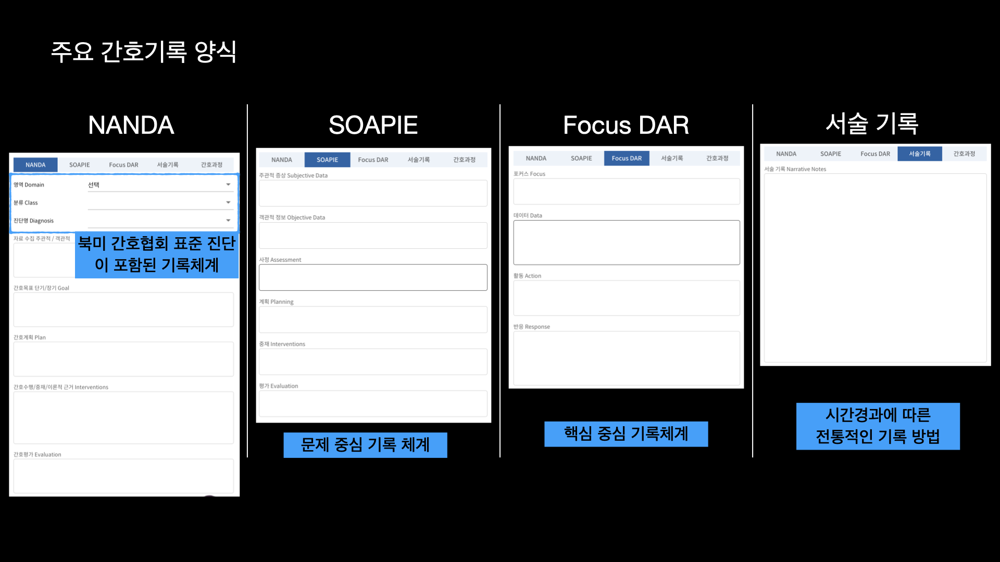
    
    μ¤λ§νΈλ„μ¤ μ‹μ¤ν… κ°„νΈκΈ°λ΅ μ–‘μ‹ μμ‹
    

# 2. λ°μ΄ν„° EDA

### a. λ°μ΄ν„° ν„ν™©

- DK Medi Info μ Smart Nurse ENR μ‹μ¤ν…μ— μ €μ¥λ μμ—°μ–΄ κ°„νΈκΈ°λ΅ λ°μ΄ν„°
- λ°μ΄ν„°μ μ : *18,400+ (NCP + AWS DB)*
    - NANDA : *1,900+*
        
        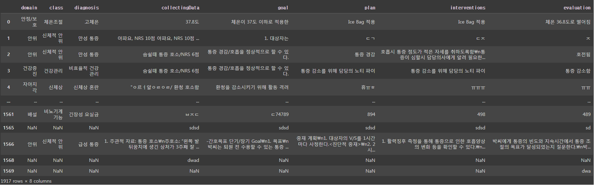
        
    - SOAPIE : *900+*
        
        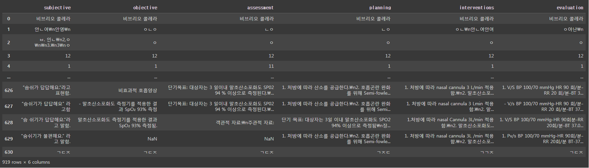
        
    - Focus_DAR : *2,200+*
        
        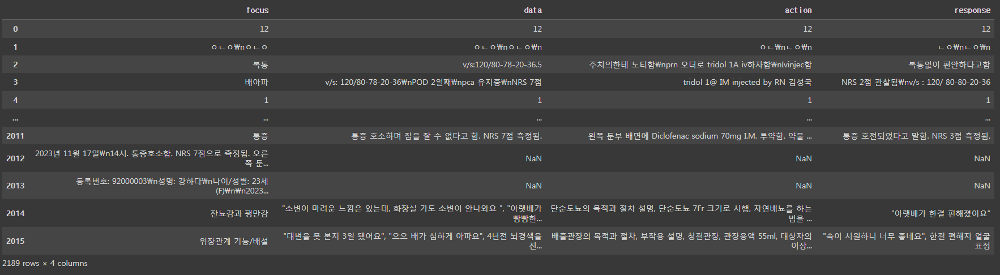
        
    - Narrative Note : *13,000+*
        
        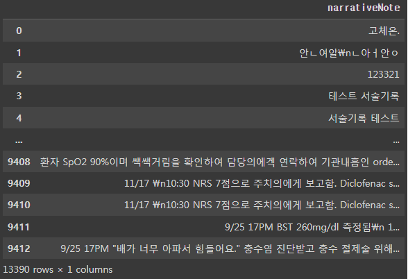
        
    - Nursing Data: *400+*
        
        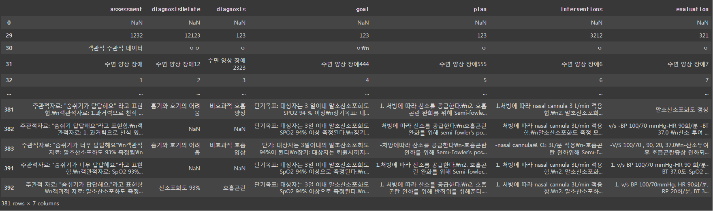
        

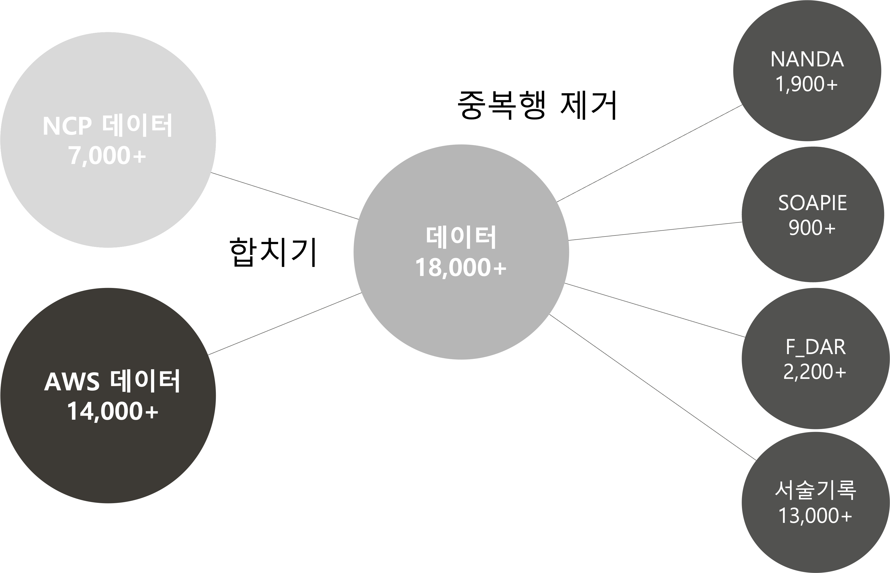

<aside>
π’΅ NaN, νΉμλ¬Έμ, μ«μ, ν•κΈ€ μμ, μ•νλ²³, λ…Έλ가사, μ–΄μƒ‰ν• λ¬Έμ¥ λ“± μλ» μ‘μ„±λ raw λ°μ΄ν„° ν™•μΈ

</aside>


---

### b. 1μ°¨ μ „μ²λ¦¬

- raw data μ§μ ‘ κ²€μ
- μ •κ·ν‘ν„μ‹ μ½”λ“ μ‘μ„±
    - μ½”λ“
        
        ```python
        # ν•„ν„°λ§ μ΅°κ±΄μ— λ§μ§€ μ•λ” ν–‰μ„ ν™•μΈν•λ” 함μ
        def is_valid_row(text):
            # μ«μλ§ / μ•νλ²³λ§ / ν•κΈ€μλ¨μλ§ / νΉμ λ¬Έμλ§ μλ” κ²½μ°
            if re.fullmatch(r'\d+', text) or re.fullmatch(r'[a-zA-Z]+', text) or re.fullmatch(r'[γ„±-γ…γ…-γ…£]+', text) or re.fullmatch(r'[^\w\s]+', text):
                return False
            return True
        
        # ν•„ν„°λ§ μ΅°κ±΄μ— λ§μ§€ μ•λ” 단어를 μ κ±°ν•λ” 함μ
        def remove_invalid_words(text)
            words = str(text).split()
            valid_words = [word for word in words if is_valid_row(word)]
            return ' '.join(valid_words) if valid_words else pd.NA  # λΉ λ¬Έμμ—΄ λ€μ‹  pd.NA λ°ν™
        
        # κΈΈμ΄κ°€ n λ―Έλ§μΈ λ°μ΄ν„°κ°€ μλ” ν–‰ μ κ±°
        def remove_short_words(text):
            # λ¬Έμμ—΄λ΅ λ³€ν™ν•κ³  λ‹¨μ–΄λ΅ λ¶„λ¦¬
            words = str(text).split()
            # κΈΈμ΄κ°€ 3 μ΄κ³ΌμΈ λ‹¨μ–΄λ§ μ ν¨ν•λ‹¤κ³  ν단
            valid_words = [word for word in words if len(word) > 3]
            # μ ν¨ν• λ‹¨μ–΄λ“¤μ„ λ‹¤μ‹ λ¬Έμμ—΄λ΅ ν•©μΉκΈ°
            return ' '.join(valid_words) if valid_words else pd.NA
        
        # λ™μμ΄μμ–΄ μ κ±°
        def unify_terms(sentence):
            S_patterns_to_unify = [
                r'<μ£Όκ΄€μ (?![\]μλ£])',
                r'\[μ£Όκ΄€μ \]',
                r'μ£Όκ΄€μ :',
                r'-μ£Όκ΄€μ :',
                r'μ£Όκ΄€μ μλ£:',
                r'\[μ£Όκ΄€μ μλ£\]',
                r'μ£Όκ΄€μ μλ£(?!\])',
                r'\<μ£Όκ΄€μ μλ£\>',
                r'\[μ£Όκ΄€μ ',
                r'\*μ£Όκ΄€μ ',
                r'\(μ£Όκ΄€μ \)',
                r'\(μ£Όκ΄€μ ',
                r'μ£Όκ΄€μ -보νΈμ',
                r'\(\[μ£Όκ΄€μ μλ£\]\)',
                r'-\[μ£Όκ΄€μ μλ£\]',
                r'\*\[μ£Όκ΄€μ μλ£\]',
            ]
        
            O_patterns_to_unify = [
                r'<κ°κ΄€μ (?![\]μλ£])',
                r'\[κ°κ΄€μ \]',
                r'κ°κ΄€μ :',
                r'-κ°κ΄€μ :',
                r'κ°κ΄€μ μλ£:',
                r'\[κ°κ΄€μ μλ£\]',
                r'κ°κ΄€μ μλ£(?!\])',
                r'\<κ°κ΄€μ μλ£\>',
                r'\[κ°κ΄€μ ',
                r'\*κ°κ΄€μ ',
                r'\(κ°κ΄€μ \)',
                r'\(κ°κ΄€μ ',
                r'κ°κ΄€μ -보νΈμ',
                r'\(\[κ°κ΄€μ μλ£\]\)',
                r'-\[κ°κ΄€μ μλ£\]',
                r'\*\[κ°κ΄€μ μλ£\]',
            ]
            ST_patterns_to_unitfy = [
                r'단기λ©ν‘:',
                r'\<단기λ©ν‘\>',
                r'단기λ©ν‘',
                r'-단기λ©ν‘',
                r'단기',
                r'단기:',
                r'\[단기\]',
                r'\<단기\>',
                r'\*단기λ©ν‘:',
                r'\*\[단기λ©ν‘\]',
                r'\*단기:',
                r'\*\<단기λ©ν‘\>',
                r'\*단기λ©ν‘',
                r'\[단기λ©ν‘\]\)',
                r'\(\[단기λ©ν‘\]\)'
            ]
            LT_patterns_to_unitfy = [
                r'μ¥κΈ°λ©ν‘:',
                r'\<μ¥κΈ°λ©ν‘\>',
                r'μ¥κΈ°λ©ν‘',
                r'-μ¥κΈ°λ©ν‘',
                r'μ¥κΈ°',
                r'μ¥κΈ°:',
                r'\[μ¥κΈ°\]',
                r'\<μ¥κΈ°\>',
                r'\*μ¥κΈ°λ©ν‘:',
                r'\*\[μ¥κΈ°λ©ν‘\]',
                r'\*μ¥κΈ°:',
                r'\*\<μ¥κΈ°λ©ν‘\>',
                r'\*μ¥κΈ°λ©ν‘',
                r'\[μ¥κΈ°λ©ν‘\]\)',
                r'\(\[μ¥κΈ°λ©ν‘\]\)'
        
            ]
        
            for pattern in S_patterns_to_unify:
              sentence = re.sub(pattern, '[μ£Όκ΄€μ μλ£]', sentence)
        
            for pattern in O_patterns_to_unify:
              sentence = re.sub(pattern, '[κ°κ΄€μ μλ£]', sentence)
        
            for pattern in ST_patterns_to_unitfy:
              sentence = re.sub(pattern, '[단기λ©ν‘]', sentence)
        
            for pattern in LT_patterns_to_unitfy:
              sentence = re.sub(pattern, '[μ¥κΈ°λ©ν‘]', sentence)
        
            # '[μ£Όκ΄€μ μλ£]μλ£]'와 κ°™μ€ ν¨ν„΄μ„ '[μ£Όκ΄€μ μλ£]'λ΅ μΉν™
            sentence = re.sub(r'\[μ£Όκ΄€μ μλ£\](μλ£\])+', '[μ£Όκ΄€μ μλ£]', sentence)
            sentence = re.sub(r'\[κ°κ΄€μ μλ£\](μλ£\])+', '[κ°κ΄€μ μλ£]', sentence)
            sentence = re.sub(r'\[\[\[단기λ©ν‘\]λ©ν‘\]\]', '[단기λ©ν‘]', sentence)
            sentence = re.sub(r'\[\[단기λ©ν‘\]λ©ν‘\]', '[단기λ©ν‘]', sentence)
            sentence = re.sub(r'\[단기λ©ν‘\]:', '[단기λ©ν‘]', sentence)
            sentence = re.sub(r'\[\[\[μ¥κΈ°λ©ν‘\]λ©ν‘\]\]', '[μ¥κΈ°λ©ν‘]', sentence)
            sentence = re.sub(r'\[\[μ¥κΈ°λ©ν‘\]λ©ν‘\]', '[μ¥κΈ°λ©ν‘]', sentence)
            sentence = re.sub(r'\[μ¥κΈ°λ©ν‘\]:', '[μ¥κΈ°λ©ν‘]', sentence)
            return sentence
        
        # 중복 ν–‰ μ κ±°
        def check_row_for_duplicates(row):
            row_values = row.tolist()
            return len(row_values) != len(set(row_values))
        
        # μ„ μ „μ²λ¦¬ 함μλ“¤μ„ μ μ©ν•λ” 함μ
        def function_apply(df, filter_column) :
            # λ¨λ“  μ—΄μ— μ μ©
            for column in df.columns :
                df[column] = df[column].apply(remove_invalid_words)
        
            # filterλ μ—΄μ—λ§ μ μ©
            for column in filter_column :
                df[column] = df[column].apply(remove_short_words)
        
            # ν–‰λ³„λ΅ μ μ©
            df = df[~df.apply(check_row_for_duplicates, axis = 1)]
        
            # '<NA>'κ°€ ν¬ν•¨λ ν–‰ μ κ±°
            df = df[~df.apply(lambda x: x.astype(str).str.contains('<NA>')).any(axis=1)]
            df = df.reset_index(drop=True)
        
            # λ¨λ“  ν–‰ λ™μμ΄μμ–΄ μ²λ¦¬
            for column in df.columns:
              df[column] = df[column].apply(unify_terms)
        
            return df
        ```
        
    - μ „κ³Ό ν›„ λΉ„κµ
        
        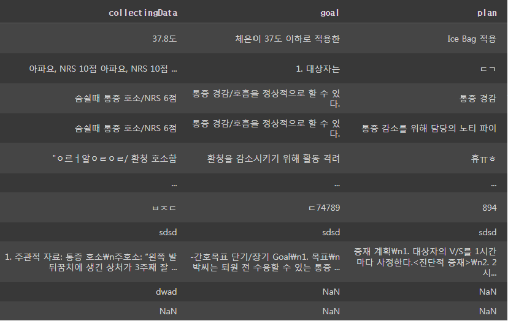
        
        **μ „μ²λ¦¬(μ „)**
        
        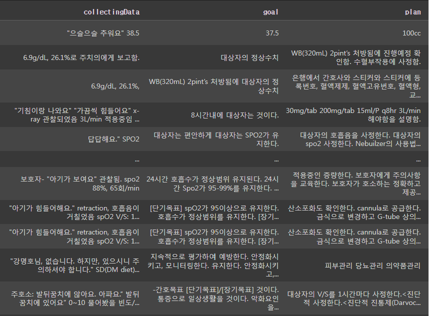
        
        μ „μ²λ¦¬(ν›„)
        
    

**μ΄μ λ° ν•κ³„μ **

- λ¶μ©μ–΄ μ²λ¦¬ μ½”λ“λ΅ μΈν•΄ μλ―Έμλ” λ‹¨μ–΄λ„ μ‚­μ λλ” κ²½μ° λ°μƒ
- λ„λ©”μΈμ— νΉν™”λ μμ—°μ–΄ λ°μ΄ν„° μ²λ¦¬μ 어려움 β†’ μ μλ―Έν• μ •λ³΄μ™€ 무μλ―Έν• μ •λ³΄μ 구분 λ° μ·¨μ‚¬μ„ νƒ
- λ°μ΄ν„° μ „μ²λ¦¬λ¥Ό κΌΌκΌΌν•κ² ν• μλ΅ μ‚¬μ©ν•  μ μλ” λ°μ΄ν„°μ μκ°€ 줄어듬 β†’ ν•™μµμ΄ μ λ지 μ•μ„ κ°€λ¥μ„±
- 실μµμ©(κµμ΅μ©) λ°μ΄ν„°μ ν•κ³„ β†’ μλ£μ—…κ³„λ” μ •ν™•ν• λ°μ΄ν„°κ°€ 중μ”ν•λ° 그렇지 λ»ν• κ²½μ°κ°€ λ§μ•μ
- λ°μ΄ν„° μ „μ²λ¦¬μ— λ§μ€ μ‹κ°„ μ†μ” β†’ κ·Έλ¬λ‚ **λ°μ΄ν„°μ „μ²λ¦¬λ” ν•κΈ€ μμ—°μ–΄μ²λ¦¬ κ³Όμ μ 핵심**

### c. 2μ°¨ μ „μ²λ¦¬

- ν•™μµ λ°μ΄ν„°μ…‹μ—μ„ μ΄ 17κ°μ λΉμ¶ λ³‘λ… μ¶”μ¶
    - `λΉ„ν¨κ³Όμ  νΈν΅ μ–‘μƒ / λΉ„ν¨κ³Όμ  κΈ°λ„μ²­κ²° / κ°€μ¤κµν™ μ¥μ•  / λ‚™μƒμ μ„ν— / λ¶μ•μ •ν• νμ••μ μ„ν— / κ·Όμ΅μ κΈ΄μ¥ / 충μμ—ΌμΌλ΅ μΈν• 복통 / μ™Έμƒμ„± μ§€μ£Όλ§‰ν• μ¶ν / 당뇨병 / 무λ¦κ΄€μ μ¦ / 퇴행성 κ΄€μ μ—Ό / ν†µμ¦ / μ•μ°½ / μλ°μ  ν™κΈ°μ¥μ•  / κΈ‰μ„±ν†µμ¦ / κ³ μ²΄μ¨ / λ¶„λ§ ν†µμ¦`
        
        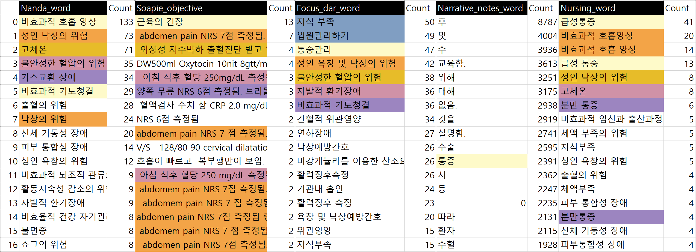
        
    - 추μ¶ν• λ³‘λ… ν‚¤μ›λ“ λ³„λ΅ λ°μ΄ν„°λ¥Ό 분λ¥ν•μ—¬ 구체μ μΌλ΅ μ „μ²λ¦¬
        - Langchain GPT prompting μ„ ν™μ©ν•μ—¬ μ–‘μ‹λ³„ λ°μ΄ν„° μ „μ²λ¦¬(λ§μ¶¤λ²• λ“±)
        - μ½”λ“
            
            ```python
            import pandas as pd
            from langchain.chat_models import AzureChatOpenAI
            from langchain.prompts import ChatPromptTemplate
            
            # Azure OpenAIλ¥Ό 사μ©ν•λ” κ°μ²΄ μƒμ„±
            chat = AzureChatOpenAI(
                deployment_name='λ¨λΈ',
                model_name='gpt-35-turbo',
            )
            
            # ν•κµ­μ–΄ ν”„λ΅¬ν”„νΈ ν…ν”λ¦Ώ μƒμ„±
            prompt = ChatPromptTemplate.from_messages(
                [
                    (
                        "system",
                        
                        """ λ‹Ήμ‹ μ€ κ°„νΈκΈ°λ΅ μ‘성지를 μ‘μ„±ν•΄μ£Όλ” μ „λ¬Έκ°€μ…λ‹λ‹¤. 다μμ μλ£κΈ°λ΅μ„ 분μ„ν•κ³  μ¤‘κ°„μ— λκΈ΄ λ¬Έμ¥μ΄ μκ±°λ‚ μ¤νƒμκ°€ μμΌλ©΄ μ•λ§κ² μμ •ν•κ³  NANDA ν•μ‹μΌλ΅ μ¶λ ¥ν•μ„Έμ”.
                        ν•κΈ€λ΅ μ‘μ„±ν•μ„Έμ”.
                        """,
                    ),
                    ("human", "{medical_record}"),
                ]
            )
            
            # 프롬프νΈμ™€ μ±„ν… λ¨λΈ κ²°ν•©
            chain = prompt | chat  
            
            # CSV νμΌμ—μ„ λ°μ΄ν„° λ¶λ¬μ¤κΈ°
            pd.read_csv("κ° μ „μ²λ¦¬ν• νμΌ κ²½λ΅")
            
            # μƒλ΅μ΄ λ°μ΄ν„°μ…‹
            new_dataset = []
            
            # κ° ν–‰ μ²λ¦¬
            for index, row in df.iterrows():
                response = chain.invoke({"medical_record": row['input']})
                new_dataset.append({'input': row['input'], 'output': response})
                print(response)
                
            
            # μƒλ΅μ΄ λ°μ΄ν„°μ…‹μ„ DataFrameμΌλ΅ λ³€ν™
            new_df = pd.DataFrame(new_dataset)
            
            # μƒλ΅μ΄ λ°μ΄ν„°μ…‹μ„ CSV νμΌλ΅ μ €μ¥
            new_df.to_csv("μ €μ¥ν•κ³  μ‹¶μ€ κ²½λ΅\\μ΄λ¦„.csv", index=False, encoding='utf-8')
            ```
            
        - μμ‹
            
            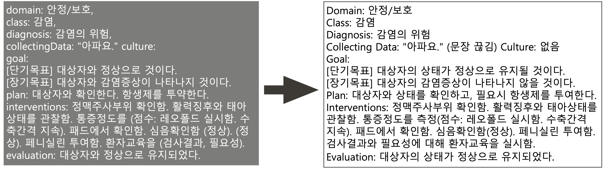
            

### d. LLM ν•™μµ λ°μ΄ν„°μ…‹ μ μ‘

- μ „μ²λ¦¬ν• λ°μ΄ν„°μ…‹μ„ LLM ν•™μµμ— ν•„μ”ν• jsonl ν•νƒλ΅ λ³€ν™
    - κ°„νΈκΈ°λ΅ λ°μ΄ν„° 컬λΌμ—μ„ λ³‘λ…(disease name) 추μ¶
        - 병λ…μ„ μ¶”μ¶ ν•  μ μ—†λ” λ°μ΄ν„°λ” μ κ±°
    - μ½”λ“
        
        ```python
        import pandas as pd
        from langchain.chat_models import ChatOpenAI
        from langchain.chat_models import AzureChatOpenAI
        from langchain.prompts import ChatPromptTemplate
        
        # Azure OpenAIλ¥Ό 사μ©ν•λ” κ°μ²΄ μƒμ„±
        chat = AzureChatOpenAI(
            deployment_name='λ¨λΈ',
            model_name='gpt-35-turbo',
        )
        
        # λ³‘λ… μ¶”μ¶ ν”„λ΅¬ν”„νΈ ν…ν”λ¦Ώ μƒμ„±
        prompt = ChatPromptTemplate.from_messages(
            [
                (
                    "system",
                    
                    """ λ‹Ήμ‹ μ€ κ°„νΈκΈ°λ΅ μ‘성지를 μ‘μ„±ν•΄μ£Όλ” μ „λ¬Έκ°€μ…λ‹λ‹¤. 다μμ μλ£κΈ°λ΅μ„ 분μ„ν•κ³  μμ‹λ¥Ό μ°Έκ³ ν•μ—¬ λ€ν‘μ μΈ λ³‘λ… ν•λ‚λ§ κΈ°μ…ν•μ„Έμ”.
                    μμ‹ : λΉ„ν¨κ³Όμ  νΈν΅ μ–‘μƒ, λΉ„ν¨κ³Όμ  κΈ°λ„μ²­κ²°, κ°€μ¤κµν™ μ¥μ• , λ‚™μƒμ μ„ν—, λ¶μ•μ •ν• νμ••μ μ„ν—, κ·Όμ΅μ κΈ΄μ¥,  충μμ—ΌμΌλ΅ μΈν• 복통,  μ™Έμƒμ„± 지주막ν•, μ¶ν,  당뇨병,  무λ¦κ΄€μ μ¦ 퇴행성 κ΄€μ μ—Ό,  통μ¦,  μ•μ°½,  μλ°μ  ν™κΈ°μ¥μ• ,  급성통μ¦,  고체μ¨,  λ¶„λ§ ν†µμ¦ 
                    """,
                ),
                ("human", "{medical_record}"),
            ]
        )
        
        # 프롬프νΈμ™€ μ±„ν… λ¨λΈ κ²°ν•©
        chain = prompt | chat  
        # CSV νμΌμ—μ„ λ°μ΄ν„° λ¶λ¬μ¤κΈ°
        pd.read_csv("λ¬Έμ¥ μμ •ν• νμΌ κ²½λ΅", encoding="utf-8")
        # μƒλ΅μ΄ λ°μ΄ν„°μ…‹
        new_dataset = []
        
        # κ° ν–‰ μ²λ¦¬
        for index, row in df.iterrows():
            response = chain.invoke({"medical_record": row['input']})
            new_dataset.append({'input': row['input'], 'disease name': response})
            print(response)
            
        
        # μƒλ΅μ΄ λ°μ΄ν„°μ…‹μ„ DataFrameμΌλ΅ λ³€ν™
        new_df = pd.DataFrame(new_dataset)
        
        # μ •μ  ν•¨μμ •μ
        def cleaning(text):
            replacements = {
                r'content=': '',
                r'.*병λ…': '병λ…',
                r'λ³‘λ… : ' : '병λ…: ',
                r'A:' : '병λ…:',
                r'주진단λ…': '병λ…',
                r'진단λ…' : '병λ…',
        
            }
        
            for pattern, replacement in replacements.items():
                text = re.sub(pattern, replacement, text)
        
            return text
        
        def clean2(text):
          text = re.sub(r'병λ…: ', '', text)
          return text
        
        # λ°μ΄ν„°ν”„λ μ„μ— ν•¨μ μ μ©
        new_df['disease name'] = new_df['disease name'].apply(cleaning)
        new_df
        
        # μƒλ΅μ΄ λ°μ΄ν„°μ…‹μ„ CSV νμΌλ΅ μ €μ¥
        new_df.to_csv("μ €μ¥ν•κ³  μ‹¶μ€ κ²½λ΅\\μ΄λ¦„.csv", index=False, encoding='utf-8')
        ```
        
    - κ²°κ³Ό
        
        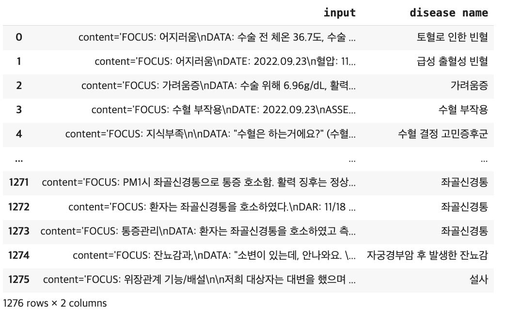
        
        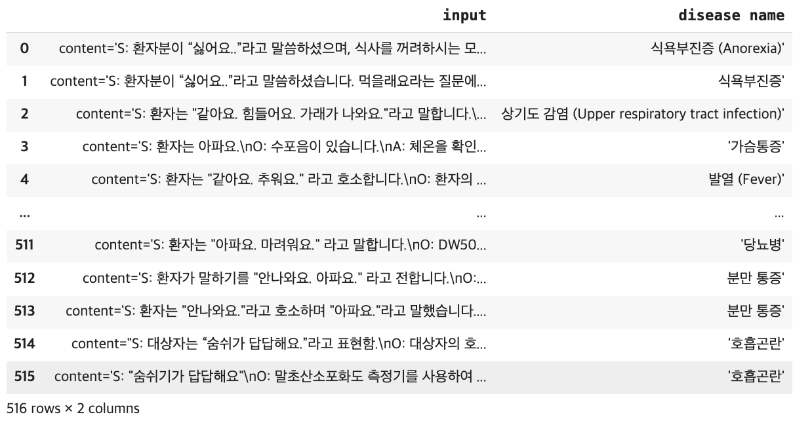
        
    - jsonl ν•νƒλ΅ λ³€ν™
    - μμ‹
        
        ```json
        
        {"role": "user", "content": "**νΈν΅κ³¤λ€**μ— λ€ν• κ°„νΈκΈ°λ΅μ„ FOCUS DARν•μ‹μΌλ΅ μ‘μ„±ν•΄μ¤"}, {"role": "assistant", "content": "FOCUS:  λΉ„κ°•μΊλ‰ΌλΌλ¥Ό ν†µν• μ‚°μ†μ”법 D: [μ£Όκ΄€μ  μλ£] \"μ¨μ‰¬κΈ°κ°€ λ‹µλ‹µν•΄μ”.\"    [κ°κ΄€μ  μλ£] νΈν΅κ³¤λ€κ³Ό μ „μ‹ μ‡ μ•½ μ¦μƒμΌλ΅ μΈν•΄ μν™κΈ°λ‚΄κ³Ό μ…μ›μΉλ£λ¥Ό μ”청함. μ•μ λ¶€μ  λ§μ΄μ‚°μ†ν¬ν™”λ„ μΈ΅μ • κ²°κ³Ό Sp02. A: - μ£ΌμΉμκ°€ cannulaλ΅ 3L/min λ§μ΄μ‚°μ†ν¬ν™”λ„ μΈ΅μ • κ²°κ³Όλ¥Ό 계μ†ν•΄μ„ λ¨λ‹ν„°λ§ν•λ©°, νΈν΅κ³¤λ€μΌλ΅ Semi-Fowler\\'s positionμ„ μ μ©ν•μ—¬ λ€μƒμμ μ „λ°μ μΈ μƒνƒλ¥Ό ν™•μΈν•¨.    - λ€μƒμμ ν™λ ¥μ§•ν›„ λ° νΈν΅μ와 μ‚°μ† μ‚¬μ©λ‰μΌλ΅ ν™”μ¬ λ°μƒ μ„ν—μ„±μ΄ μμ–΄ λΉ„κ°•μΊλ‰ΌλΌλ¥Ό ν†µν• μ‚°μ†μ”λ²•μ„ μ‹ν–‰ν•κ³ , 피부 μ†μƒμ μ„ν—μ„±μ— λ€ν•΄ μ μ함. R: νμ•• 100/70mmHg, 맥박 90ν/분, νΈν΅μ 20ν/분, μ²΄μ¨ 37.0ΛC, Sp02 μΈ΅μ • κ²°κ³Ό νΈν΅κ³¤λ€μ΄ μ™„ν™”λμ—μΌλ©°, λ€μƒμκ°€ κµμ΅ λ‚΄μ©μ„ μ΄ν•΄ν•κ³  νΈμ•ν•λ‹¤κ³  함."}]}
        {"role": "user", "content": "**μ„μ¥κ΄€ μ”λ¥μ¦**μ— λ€ν• κ°„νΈκΈ°λ΅μ„ NarrativeNoteν•μ‹μΌλ΅ μ‘μ„±ν•΄μ¤"}, {"role": "assistant", "content": "NarrativeNote: λ€μƒμμ μ„κ΄€μμ–‘μ„ ν™•μΈν• κ²°κ³Ό 23mLμ μ”λ¥λ‰μ΄ μμ—μµλ‹λ‹¤. μ΄μ— λ€ν•΄ 1200ccμ 액체를 L-Tube λ°©λ²•μ„ ν†µν•΄ μ£Όμ…ν•μ€μΌλ©°, gtt/minμ„ μ„¤μ •ν•μ€μµλ‹λ‹¤. λ€μƒμλ” λ³µλ¶€ν½λ§ μ¦μƒμ΄ μ—†μ—κ³ , λ°μΆμ„λ¥Ό μ·¨ν•λ„λ΅ κµμ΅ν•μ€μµλ‹λ‹¤."}]}
        {"role": "user", "content": "**μƒμ„Έλ¶λ…μ λ°”μ΄λ¬μ¤μ— μν• λΉ„ν¨κ³Όμ  νΈν΅ μ–‘μƒ**μ— λ€ν• κ°„νΈκΈ°λ΅μ„ NANDA DARν•μ‹μΌλ΅ μ‘μ„±ν•΄μ¤"}, {"role": "assistant", "content": "Domain: ν™λ™/ν΄μ‹  [Class] 심νκ΄€/νΈν΅κΈ°κ³„ λ°μ‘  [Diagnosis] λΉ„ν¨κ³Όμ  νΈν΅ μ–‘μƒ  [Collecting Data] ν™μλ” \"μ¨μ‰¬κΈ°κ°€ λ¶νΈν•΄μ”\" λΌκ³  μ–ΈκΈ‰ν•μ€μΌλ©°, 진단λ…μ€ μƒμ„Έλ¶λ…μ λ°”μ΄λ¬μ¤μ΄κ³ , x-ray κ²°κ³Όλ” rightμ΄λ©° 110/70 RR25 Spo2 μ•μƒ‰κ±°λ¦¬λ” \"sutum\"μ΄ λ°κ²¬λμ—다.  [Goal] - 단기λ©ν‘: λ€μƒμλ” μ •μƒμ μΈ νΈν΅μ–‘μƒμ„ κ°€μ§€κ² λ다. - μ¥κΈ°λ©ν‘: λ€μƒμλ” νΈν΅ν•κΈ° νΈμ•ν•κ² λ다.  [Plan] - νΈν΅μ와 λ¦¬λ“¬μ„ μΈ΅μ •ν•κ³ , ν•„μ”μ‹ μ΅°μ •ν•λ‹¤. - ν¨μ¨μ μΈ κΈ°μΉ¨μ„ ν•λ„λ΅ λ€μƒμλ¥Ό 격려ν•λ‹¤. - λ€μƒμλ¥Ό μΏ μ…μΌλ΅ 지지ν•μ—¬ νΈν΅κΈ°κ³„ 사μ©μ΄ ν•„μ”ν•λ‹¤λ©΄ 사μ©ν•λ‹¤.  [Interventions] - νΈν΅μ와 λ¦¬λ“¬μ„ μΈ΅μ •ν•μ€κ³ , 11/15 09:00μ— λ³€κ²½ν•μ€λ‹¤. - ν™μ분κ»μ„ νΈν΅κΈ° 관리를 μ„ν•΄ λ³€κ²½ν•΄μ£Όμ—다. - λ€μƒμκ°€ ν¨μ¨μ μΌλ΅ κΈ°μΉ¨ν•  μ μλ„λ΅ κ²©λ ¤ν•μ€λ‹¤. - λ€μƒμλ¥Ό ν¨μ¨μ μΌλ΅ 격려ν•μ—¬ λ°°μ¶μ΄ μ›ν™ν•λ„λ΅ λ„왔다. - λ€μƒμλ¥Ό μΏ μ…μΌλ΅ 지지ν•μ—¬ νΈν΅κΈ°κ³„ 사μ©μ΄ ν•„μ”ν•λ‹¤λ©΄ 사μ©ν•μ€λ‹¤.  [Evaluation] - 단기λ©ν‘: λ€μƒμλ” μ •μƒμ μΈ νΈν΅μ–‘μƒμ„ (미달성) 11/16 09:00 ν™μ분κ»μ„ μ „λ³΄λ‹¤λ” λ‚μ•„μ΅μ§€λ§ λ¶νΈν•¨μ„ νΈμ†ν•μ€λ‹¤. - μ¥κΈ°λ©ν‘: λ€μƒμλ” νΈν΅ν•κΈ° νΈμ•ν•λ‹¤κ³  ν단할 μ μ—†μΌλ©°, 추후 κ΄€μ°°μ΄ ν•„μ”ν•λ‹¤. (2022.11.15)"}]}
        {"role": "user", "content": "**μ§€μ£Όλ§‰ν• μ¶ν**μ— λ€ν• κ°„νΈκΈ°λ΅μ„ SOAPIEν•μ‹μΌλ΅ μ‘μ„±ν•΄μ¤"}, {"role": "assistant", "content": "S: \"ν™μκ°€ λ¨Ήμ„ λ•λ§λ‹¤ κ±Έλ ¤μ”\" O: μ§€μ£Όλ§‰ν• μ¶ν 진단μΌλ΅ μ…μ›ν•μ—¬ μΉλ£ 중μ΄λ©° κΈ°μΉ¨μ΄ κ΄€μ°°λ©λ‹λ‹¤. A: -μ—°ν•κ³¤λ€μΌλ΅ 구강섭취 μ–΄λ ¤μ›€μ΄ μμ. P: semi-fowlerμ μμ„Έλ΅ μ·¨μΉ¨ μ‹ν‚¤κΈ°, ν•„μ”μ‹ κ²½μ¥ μμ–‘μ•΅ μ κ³µ λ° ν΅μΈ μ‹ ν¬μ—¬ν•κΈ°. I: -κ²½μ¥ μμ–‘μ•΅ μ행함. -κ²½μ¥ μμ–‘ ν¬μ—¬λ¥Ό μ„ν•΄ ν΅μΈν•μ—¬ ν™•μΈν•¨. -L-tube μ‚½μ…ν•μ—¬ 200ml μ£Όμ…함. 30mlμ”© μ£Όμ…함. 측정함. -앉아μμ„ λ•μ κµμ΅μ„ μ‹ν–‰ν•¨. E: -L-tube μ‚½μ… ν›„ semi-fowlerμ μμ„Έλ¥Ό μ μ§€ν•¨."}]}
        ```
        
- μµμΆ…μ μΌλ΅ ν•™μµμ— 사μ©ν• λ°μ΄ν„°
    
    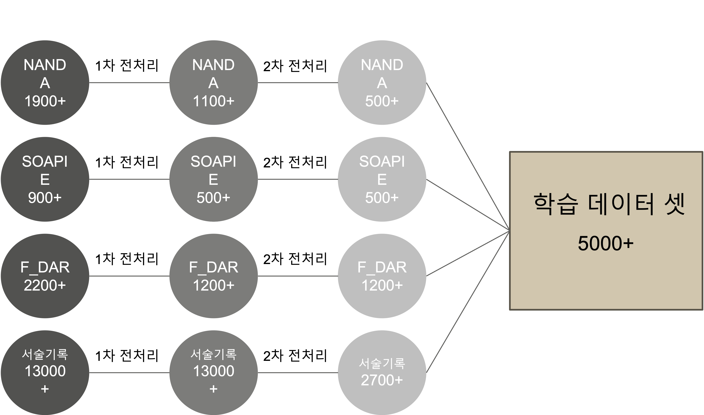
    

# 3. Model : LLM(GPT-3.5 Turbo) Fine Tuning

### a. GPT API : Microsoft Azure Open AI

- GPT API λ¶λ¬μ¤κΈ° μ½”λ“
    
    ```python
    !pip install openai
    from openai import OpenAI
    
    #api λ¶λ¬μ¤κΈ°
    client = OpenAI(api_key=" ")
    prompt = [{"role": "system", "content": "system"}]
    
    def chat(text):
      user_input = {"role": "user", "content": text}
      prompt.append(user_input)
      answer = client.chat.completions.create(
          model="gpt-3.5-turbo",
          prompt=prompt,
          temperature=1,
          top_p=0.9) # 다른 parameter 추가
    
      answ = answer.to_dict_recursive()
      bot_answ = answer['choices'][0]['meassage']['content']
      bot_resp = {"role" : "assistant", "content" : bot_answ}
      prompt.append(bot_resp)
      return bot_answ
    
    print(chat("λ‚™μƒ κ³ μ„ν—κµ° κ°„νΈκΈ°λ΅ μ¨μ¤."))
    ```
    
    β†’ κΈ°μ—…μ—μ„ μ κ³µν• Azureλ¥Ό ν†µν•΄μ„ OpenAI APIλ¥Ό 사μ©ν•  μμ •
    

### b. GPT Fine-tuning

- λΉμ¶ 병λ…별 κ° μ–‘μ‹μ μ΄μƒμ μΈ μƒν” λ°μ΄ν„°μ…‹ μ μ‘
    - ChatGPT ν™μ©
        
        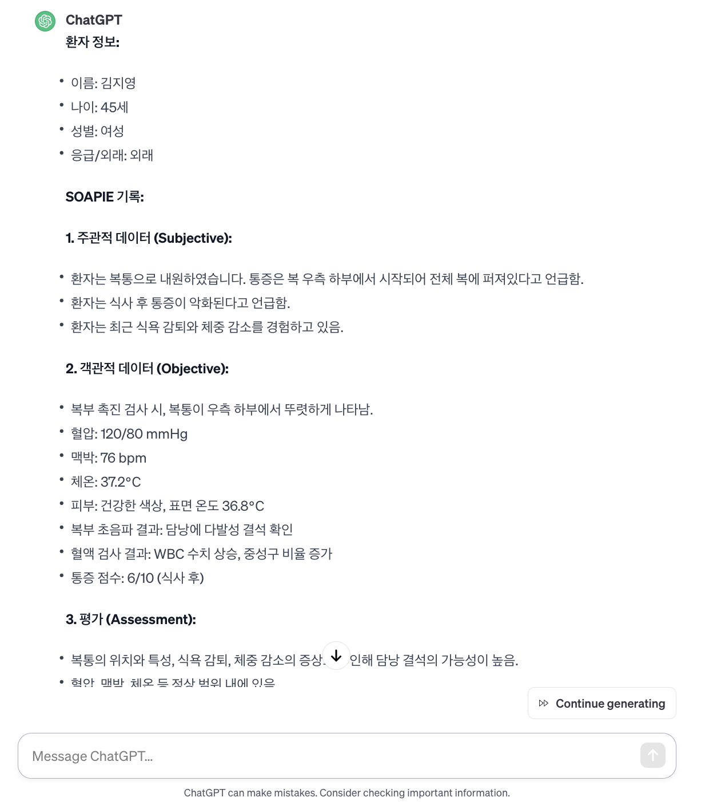
        
        - ChatGPTμ— λ€ν• μ¤λ¥ 체ν¬
        (e.g. 통μ¦ν™μμ κ°„νΈκΈ°λ΅μ„ μ‘μ„±ν•λΌλ” instructμ— β€ν•ν’ ν†µμ¦ ν™μ’ μμ‹λ¥Ό μƒμ„±)
    - μtl
- GPT Fine-tuning
    - Instruction tuning
        
        ```python
        system_instruction =
        """
        λ„λ” λ€ν•™λ³‘μ› κ°„νΈμ‚¬μ•Ό. 다μμ 지침λ€λ΅ λΉ„ν¨κ³Όμ  νΈν΅ μ–‘μƒ ν™μμ κ°„νΈκΈ°λ΅μ„ 구체μ μΌλ΅ μ‘μ„±ν•΄μ¤.
        
        1. NANDA, SOAPIE, Focus DAR λ“± κ°„νΈκΈ°λ΅ μ–‘μ‹μ— λ§κ² μ μ–΄μ£Όμ„Έμ”.
        2. μ£Όμ” μ¦μƒ λ° νΉμ„±, 단기 λ° μ¥κΈ° λ©ν‘, κ°„νΈ μ¤‘μ¬, κ°„νΈ ν‰κ°€ ν•­λ©μ„ ν•„μ κΈ°μ¬ν•μ„Έμ”.
        3. μµλ€ν• 구체μ μΌλ΅ μ‘μ„±ν•μ„Έμ”. μλ¥Ό 들어 'μ μ ν• νΈν΅ 기법 κµμ΅'μ΄λ€ λ‹µλ³€ 보단 'νΈν΅ μ΄λ™ κµμ΅: κΉκ³  μ²μ²ν μ¨μ‰¬κΈ°, λ³µμ‹νΈν΅λ²• κµμ΅'μ΄ μΆ‹μµλ‹λ‹¤.
        4. μ •ν™•ν• μμΉλ¥Ό κΈ°λ΅ν•μ„Έμ”. μλ¥Ό 들어 'ν™μμ νΈν΅μκ°€ 24μ‹κ°„ μ΄λ‚΄μ— 분당 12~20νλ΅ μ •μƒ λ²”μ„ λ‚΄λ΅ κ°μ†'
        5. μ •ν™•ν•κ³  κ°„κ²°ν• λ§ν¬λ¥Ό 사μ©ν•μ„Έμ”. ~μ…λ‹λ‹¤. ~μ—μ” κ°™μ€ λ¬Έμ¥μ‹ μ„μ μ€ ν”Όν•΄μ£Όμ„Έμ”.
        
        """
        ```
        
    - Prompt tuning
        
        ```python
        prompt_format = """"
        {"role": "system", "content": instruction"}, {"role": "user", "content": "Question"}, {"role": "assistant", "content": "Answer"}
        """
        prompt = [
            {"role": "system", "content": system_instruction}, {"role": "user", "content": "λΉ„ν¨κ³Όμ  νΈν΅ μ–‘μƒ ν™μμ κ°„νΈκΈ°λ΅ NANDA μ–‘μ‹μΌλ΅ μ‘μ„±ν•΄μ¤."}, {"role": "assistant", "content": "ν™μ 정보:\n\nμ΄λ¦„: μ΄ν•΄μ¤€\nλ‚μ΄: 34μ„Έ\n성별: 남성\n\n진단: λΉ„ν¨κ³Όμ  νΈν΅ μ–‘μƒ (NANDA-I #00032)\n\nμ£Όμ” μ¦μƒ λ° νΉμ„±:\n\n*νΈν΅μ μ¦κ°€ (분당 24ν)\n*νΈν΅κ³¤λ€ μ¦μƒ (μ–•κ³  λΉ λ¥Έ νΈν΅)\n*μ‚°μ†ν¬ν™”λ„ κ°μ† (92%)\n*ν™μμ μ£Όκ΄€μ  νΈν΅ λ¶νΈ ν‘ν„\n\n단기 λ©ν‘:\n\n*ν™μμ νΈν΅μκ°€ 24μ‹κ°„ μ΄λ‚΄μ— 분당 12~20νλ΅ μ •μƒ λ²”μ„ λ‚΄λ΅ κ°μ†\n*μ‚°μ†ν¬ν™”λ„κ°€ 95% μ΄μƒμΌλ΅ μ μ§€\n\nμ¥κΈ° λ©ν‘:\n\n*ν™μκ°€ νΈν΅ 곤λ€μ„ νΈμ†ν•μ§€ μ•κ³ , μ‚°μ†ν¬ν™”λ„κ°€ 지μ†μ μΌλ΅ 95% μ΄μƒ μ μ§€\n*ν™μκ°€ νΈν΅μ— κ΄€λ ¨λ μκ°€ 관리 λ°©λ²•μ„ μ΄ν•΄ν•κ³  실행\n\nκ°„νΈ κ³„ν λ° μ¤‘μ¬:\n\n*νΈν΅ μƒνƒ λ¨λ‹ν„°λ§: 2μ‹κ°„λ§λ‹¤ νΈν΅μ, μ‚°μ†ν¬ν™”λ„ μ²΄ν¬\n*μ‚°μ† μ”법: μ사μ 지μ‹μ— λ”°λΌ μ‚°μ† κ³µκΈ‰ (ν•„μ” μ‹)\n*νΈν΅ μ΄λ™ κµμ΅: κΉκ³  μ²μ²ν μ¨μ‰¬κΈ°, λ³µμ‹νΈν΅λ²• κµμ΅\n*μ•μ„ μ κ³µ: νΈμ•ν• μμ„Έ μ μ§€, μ¤νΈλ μ¤ κ°μ† 방법 μ•λ‚΄\n*κµμ΅ λ° μƒλ‹΄: νΈν΅κ³¤λ€μ μ›μΈκ³Ό 관리 방법 설λ…\n\nκ°„νΈ ν‰κ°€:\n*νΈν΅ μƒνƒ: νΈν΅μ λ° μ‚°μ†ν¬ν™”λ„ λ³€ν™” λ¨λ‹ν„°λ§\n*ν™μμ μκ°€ 관리 λ¥λ ¥: νΈν΅ μ΄λ™ μ‹¤μ‹ μ—¬λ¶€ λ° ν¨κ³Ό ν‰κ°€\n*κµμ΅ ν¨κ³Ό: ν™μμ μ΄ν•΄λ„ λ° λ°μ‘ κ΄€μ°°"},
            {"role": "system", "content": system_instruction}, {"role": "user", "content": "κ³ μ²΄μ¨ ν™μμ κ°„νΈκΈ°λ΅μ„ SOAPIE μ–‘μ‹μΌλ΅ μ‘μ„±ν•΄μ¤."}, {"role": "assistant", "content":"ν™μ 정보: \n μ΄λ¦„: μ •μν„\n λ‚μ΄: 32μ„Έ\n 성별: μ—¬μ„±\n\nSOAPIE κΈ°λ΅:\n\nS: μ£Όκ΄€μ  λ°μ΄ν„° (Subjective):\n ν™μλ” μµκ·Όμ— 체μ¨μ΄ 계μ†ν•΄μ„ 높아지며 "'κ³„μ† λ•€μ΄ λ‚κ³  λΈμ΄ 쑤셔'"λΌκ³  언급함.\n\nO: κ°κ΄€μ  λ°μ΄ν„° (Objective): \n체μ¨μ΄ 38.8Β°Cλ΅ μƒμΉ\nν”Όλ¶€λ” λ¨κ±°μ› 보μ΄κ³  λ•€μ΄ λ§μ΄ λ‚κ³  μμ. \nμ‹μ• κ°μ† λ° μ²΄μ¤‘ κ°μ†λ„ κ΄€μ°°λ¨.\n\nA: ν‰κ°€ (Assessment): \nν™μλ” κ³ μ²΄μ¨ μƒνƒμ— μμ\n고체μ¨μ΄ μ‹μ• κ°μ†μ™€ 체중 κ°μ†λ¥Ό μ λ°ν•¨.\n\nP: 계ν (Plan):  \n1. μ μ ν• μ분 κ³µκΈ‰κ³Ό 냉κ°μ„ μ„ν• κ°„νΈ μ¤‘μ¬   \n2. μ²΄μ¨ μ΅°μ μ„ μ„ν• μ사와μ ν‘λ ¥   \n3. μμ–‘ μƒνƒ ν‰κ°€ λ° μμ–‘μ  ν¬μ—¬ κ²€ν† .\n\nI: κ°„νΈ μ¤‘μ¬ (Intervention): \n1. μ μ ν• μ분 κ³µκΈ‰ λ° λƒ‰κ°μ„ μ„ν•΄ μΏ¨λ§ ν…ν¬λ‹‰ μ μ©   \n2. μ사μ 지μ‹μ— λ”°λΌ μ²΄μ¨ μ΅°μ μ„ μ„ν• μΉλ£ μ‹ν–‰   \n3. μ양사와 ν‘λ ¥ν•μ—¬ ν™μμ μμ–‘ μƒνƒλ¥Ό ν‰κ°€ν•κ³  ν•„μ” μ‹ μμ–‘μ  ν¬μ—¬.\n\nE: ν‰κ°€ (Evaluation): \n1. μΏ¨λ§ ν…ν¬λ‹‰κ³Ό μ분 κ³µκΈ‰μΌλ΅ 체μ¨μ΄ μ•μ •λκ³  λ•€μ΄ κ°μ†ν•¨  \n 2. μ사μ μΉλ£λ΅ 체μ¨μ΄ μ •μƒ λ²”μ„λ΅ νλ³µλ¨   \n3. μμ–‘ μƒνƒκ°€ ν–¥μƒλκ³  μ²΄μ¤‘μ΄ μ¦κ°€ν•¨."},
            {"role": "system", "content": system_instruction}, {"role": "user", "content": "분λ§ν†µμ¦ ν™μμ κ°„νΈκΈ°λ΅μ„ Focus DAR μ–‘μ‹μΌλ΅ μ‘μ„±ν•΄μ¤."}, {"role": "assistant", "content":"ν™μ 정보:\nμ΄λ¦„: κΉ€μ§€μ€  \nλ‚μ΄: 28μ„Έ  \n성별: μ—¬μ„±  \n\nFocus: λ¶„λ§ ν†µμ¦ κ΄€λ¦¬  \n\nData:\n ν™μλ” ν„μ¬ 38μ£Όμ— μ…μ„±ν• μ„신부λ΅, μ연분λ§μ„ ν†µν• λ¶„λ§μ„ 계νν•κ³  μμ.\n ν™μλ” 1μ‹κ°„ 간격μΌλ΅ μλ°μ μΌλ΅ μ‹μ‘λ μκ¶ μμ¶•μ΄ μ§„ν–‰ 중μ΄λ©°, μ축 κ°„κ²©μ΄ μ μ°¨ κ°μ†ν•κ³  μμ.\n λ¶„λ§ λ„μ¤‘μ— ν†µμ¦μ΄ κ°•ν•κ² λ껴지며, μκ·Ήμ„ λ°›μ„ λ•μ™€ μ축 μ¤‘μ— κ°€μ¥ κ°•ν• ν†µμ¦μ„ λλΌκ³  μμ.\n 통μ¦μ κ°•λ„λ” Visual Analog Scale (VAS)λ΅ 8μ μΌλ΅ ν‰κ°€λλ©°, 통μ¦κ³Ό ν•¨κ» νΈν΅ κ³¤λ€ λ° μ•μ λ¶€μ  λ»ν•λ” λλ‚μ„ νΈμ†ν•¨.\n μ‚°λ¨λ” μ연분λ§μ„ μ›ν•λ©°, 진통μ μ— λ€ν• κ°μ…μ„ μµμ†ν™”ν•κ³ μ 함.\n\nAction:\n1. κ°„νΈμ§„μ€ μ‚°λ¨μ ν†µμ¦ κ²½ν—μ„ μ •ν™•ν κΈ°λ΅ν•κ³ , μ연분λ§μ„ μ„ν• ν†µμ¦ κ΄€λ¦¬ 계ν μ립.\n2. 통μ¦μ κ°•λ„ λ° λλ‚μ„ μ •ν™•ν κΈ°λ΅ν•κ³ , μ축과 ν†µμ¦ κ°„μ 관계를 분μ„ν•μ—¬ μµμ μ 관리 μ „λµμ„ μ°Ύμ.\n3. νΈν΅ λ° μ•μ •μ μΈ μμ„Έ μ μ§€μ— λ€ν• κµμ΅μ„ 실μ‹ν•μ—¬ μ‚°λ¨κ°€ ν¨κ³Όμ μΈ ν†µμ¦ κ΄€λ¦¬λ¥Ό μ„ν•΄ μ μ ν• λ°©λ²•μ„ ν™μ©ν•λ„λ΅ μ§€μ›.\n4. μ‚°λ¨μ 통μ¦μ— λ€ν• μ΄ν•΄λ„λ¥Ό λ†’μ΄κ³ , μ‚°λ¨μ™€ λ™λ°μμ—κ² ν‘λ ¥μ μΈ ν†µμ¦ κ΄€λ¦¬μ— λ€ν• μ§€μΉ¨μ„ μ κ³µ.\n5. ν•„μ”ν• κ²½μ° μ사와 ν‘λ ¥ν•μ—¬ 추가μ μΈ ν†µμ¦ κ΄€λ¦¬ μµμ…μ„ κ²€ν† ν•κ³ , λ¶„λ§ μ§„ν–‰ μƒν™©μ— λ”°λΌ κ΄€λ¦¬ 계νμ„ μ΅°μ .\n\nResponse:\n μ‚°λ¨λ” νΈν΅ λ° μ•μ •μ μΈ μμ„Έ μ μ§€λ¥Ό 통해 통μ¦μ„ μΌλ¶€ μ™„ν™”ν•κ³ , μ μ ν• λ°©λ²•μ„ ν™μ©ν•μ—¬ 통μ¦μ— λ€μ²ν•¨.\n 통μ¦μ κ°•λ„와 λλ‚μ„ μ •ν™•ν κΈ°λ΅ν•μ—¬ κ°„νΈμ§„μ€ ν¨κ³Όμ μΈ ν†µμ¦ κ΄€λ¦¬ 계νμ„ μ립ν•κ³  μ΅°μ ν•¨.\n μ‚°λ¨λ” 진통μ μ— λ€ν• κ°μ…μ„ μµμ†ν™”ν•κ³ , μ연분λ§μ κ²½ν—μ„ μ¤‘μ”μ‹ν•μ—¬ 통μ¦μ„ λ”μ± κ΄€λ¦¬ κ°€λ¥ν• μ준μΌλ΅ μ μ§€ν•¨.\n κ°„νΈμ§„μ κµμ΅κ³Ό 지μ›μ„ 통해 μ‚°λ¨μ™€ λ™λ°μλ” ν†µμ¦ κ΄€λ¦¬μ— λ€ν• μ΄ν•΄λ„κ°€ ν–¥μƒλμ–΄ ν‘λ ¥μ μΌλ΅ 참여함.\n λ¶„λ§ λ„중μ—λ” μ‚°λ¨μ ν†µμ¦ κ΄€λ¦¬λ¥Ό κ³„μ† λ¨λ‹ν„°λ§ν•κ³ , ν•„μ”μ— λ”°λΌ μ사와 ν‘λ ¥ν•μ—¬ 추가μ μΈ μ΅°μΉλ¥Ό 취함."},
            {"role": "system", "content": system_instruction}, {"role": "user", "content": "κ°€μ¤ κµν™ μ¥μ•  ν™μμ κ°„νΈκΈ°λ΅ Narrative Note μ–‘μ‹μΌλ΅ μ‘μ„±ν•΄μ¤."}, {"role": "assistant", "content": "ν™μ 정보: \n μ΄λ¦„: μ΄μ² μ\n λ‚μ΄: 65μ„Έ\n 성별: 남성\n\nν™μ μ΄μ² μ μ”¨λ” λ¶μ•μ •ν• νμ••μΌλ΅ μ…μ›ν•μ€μ. μ…μ› λ‹Ήμ‹ νμ••μ€ 160/100 mmHgλ΅ μΈ΅μ •λμ—μΌλ©°, κ³Όκ±°λ ¥μΌλ΅ κ³ νμ•• λ° λ‹Ήλ‡¨λ³‘μ΄ μμ. ν™μλ” ν„κΈ°μ¦κ³Ό λ‘ν†µμ„ νΈμ†ν•¨. 추가μ μΌλ΅ ν™μλ” μµκ·Ό λ‡ μ£Όκ°„ μ•½λ¬Ό λ³µμ©μ„ μμ£Ό μ어버린다고 보고함.\n\nμ¤λ μ•„μΉ¨ νμ•• μΈ΅μ • κ²°κ³Όλ” 155/95 mmHgμ€μΌλ©°, μ¤μ „ μ¤‘μ— μΌμ‹μ μΌλ΅ 145/90 mmHgλ΅ κ°μ†ν•λ” κ²½ν–¥μ„ λ³΄μ„. ν™μλ” λ¶κ·μΉ™μ μΈ νμ•• λ³€ν™”μ— λ€ν•΄ μ°λ ¤λ¥Ό ν‘ν„함. ν™μμ νμ•• λ³€λ™κ³Ό κ΄€λ ¨ν•μ—¬ μƒν™ μµκ΄€, μ‹μ΄, μ•½λ¬Ό λ³µμ© ν¨ν„΄ λ“±μ„ λ©΄λ°€ν ν‰κ°€ν•¨.\n\nκ°„νΈ μ¤‘μ¬λ΅λ” νμ•• λ¨λ‹ν„°λ§μ„ 매 4μ‹κ°„λ§λ‹¤ 실μ‹ν•κ³ , μ사 지μ‹μ— λ”°λΌ νμ•• μ΅°μ  μ•½λ¬Όμ„ ν¬μ—¬ν•¨. ν™μμ—κ² μ•½λ¬Ό λ³µμ© μΌμ •μ„ 관리할 μ μλ” λ°©λ²•μ„ μ•λ‚΄ν•κ³ , μ €μ—Όμ‹ μ‹λ‹¨κ³Ό κ·μΉ™μ μΈ μ΄λ™μ 중μ”μ„±μ— λ€ν•΄ κµμ΅ν•¨.\n\nμ¤ν›„ νμ•• μΈ΅μ • κ²°κ³Όλ” 150/92 mmHgλ΅ λ‹¤μ† μ•μ •λ κ²½ν–¥μ„ λ³΄μ„. ν™μλ” μ κ³µλ κµμ΅ λ‚΄μ©μ— λ€ν•΄ κΈμ •μ μΈ λ°μ‘μ„ λ³΄μ΄λ©°, μ•½λ¬Ό λ³µμ©κ³Ό μƒν™ μµκ΄€ κ°μ„ μ— λ€ν• μ지를 ν‘ν„함. ν–¥ν›„ 계νμΌλ΅λ” 지μ†μ μΈ νμ•• λ¨λ‹ν„°λ§, μ•½λ¬Ό 관리 λ° ν™μ κµμ΅μ„ μ΄μ–΄κ° μμ •μ„."}
            ]
        ```
        
    - μ½”λ“
        
        ```python
        import os
        from openai import AzureOpenAI
        import pandas as pd
        # API λ¶λ¬μ¤κΈ°
        client = AzureOpenAI(
            api_key = 'key',
            api_version = 'version',
            azure_endpoint = 'url'
        
        # prompt tuning model
        
        system_instruction = "You are an assistant who needs to help nurses who are overwhelmed with nursing records(ENR).\
         You are a nurse in a tertiary care hospital or university hospital. Please complete a detailed nursing record for a patient with ineffective respiration using the following instructions.\
         1. NANDA κΈ°λ΅μ–‘μ‹, SOAPIE( S: subject data, O: object data, A: assessment, P: plan, I: intervention, E: evalutaion), Focus DAR(Focus, Data, Action, Response) λ“±μ κΈ°λ΅ μ–‘μ‹μ— λ§μ¶°μ„ μ‘μ„± ν•μ„Έμ”.\
         2. μµλ€ν• 구체μ μΌλ΅ μ‘μ„±ν•μ„Έμ”. μλ¥Ό 들어 β€μ μ ν• νΈν΅ 기법 κµμ΅β€μ΄λ€ λ‹µλ³€ 보단 β€νΈν΅ μ΄λ™ κµμ΅: κΉκ³  μ²μ²ν μ¨μ‰¬κΈ°, λ³µμ‹νΈν΅λ²• κµμ΅β€μ΄ μΆ‹μµλ‹λ‹¤.\
         3. κ°€λ¥ν• μ •ν™•ν• μμΉ λ°μ΄ν„°λ¥Ό 사μ©ν•μ„Έμ”. μλ¥Ό 들어 β€ν™μμ νΈν΅μκ°€ 24μ‹κ°„ μ΄λ‚΄μ— 분당 12~20νλ΅ μ •μƒ λ²”μ„ λ‚΄λ΅ κ°μ†β€™\
         4. μ •ν™•ν•κ³  κ°„κ²°ν• λ§ν¬λ¥Ό 사μ©ν•μ„Έμ”. -μ, -함, -μ„ κ³Ό κ°™μ€ μ–΄λ―Έλ¥Ό 사μ©ν•μ„Έμ”.\
         5. ν™μ 정보(μ΄λ¦„, λ‚μ΄, 성별) μ„ ν¬ν•¨ν•μ„Έμ”.\
         6. ν•μ„κµ¬μ΅°λ” μ«μ λ€μ‹  bullet ν•μ‹μ„ 사μ©ν•μ„Έμ”.\
         7. user κ°€ μ μ‹ν•λ” λ°μ΄ν„°κ°€ μμ„ λ•λ” κ·Έ λ°μ΄ν„°λ¥Ό 사μ©ν•μ—¬ μ‘μ„±ν•μ„Έμ”. "
        
        prompt = [
            {"role": "system", "content": system_instruction}, {"role": "user", "content": "λΉ„ν¨κ³Όμ  νΈν΅ μ–‘μƒ ν™μμ κ°„νΈκΈ°λ΅ NANDA μ–‘μ‹μΌλ΅ μ‘μ„±ν•΄μ¤."}, {"role": "assistant", "content": "ν™μ 정보:\n\nμ΄λ¦„: μ΄ν•΄μ¤€\nλ‚μ΄: 34μ„Έ\n성별: 남성\n\n진단: λΉ„ν¨κ³Όμ  νΈν΅ μ–‘μƒ (NANDA-I #00032)\n\nμ£Όμ” μ¦μƒ λ° νΉμ„±:\n\n*νΈν΅μ μ¦κ°€ (분당 24ν)\n*νΈν΅κ³¤λ€ μ¦μƒ (μ–•κ³  λΉ λ¥Έ νΈν΅)\n*μ‚°μ†ν¬ν™”λ„ κ°μ† (92%)\n*ν™μμ μ£Όκ΄€μ  νΈν΅ λ¶νΈ ν‘ν„\n\n단기 λ©ν‘:\n\n*ν™μμ νΈν΅μκ°€ 24μ‹κ°„ μ΄λ‚΄μ— 분당 12~20νλ΅ μ •μƒ λ²”μ„ λ‚΄λ΅ κ°μ†\n*μ‚°μ†ν¬ν™”λ„κ°€ 95% μ΄μƒμΌλ΅ μ μ§€\n\nμ¥κΈ° λ©ν‘:\n\n*ν™μκ°€ νΈν΅ 곤λ€μ„ νΈμ†ν•μ§€ μ•κ³ , μ‚°μ†ν¬ν™”λ„κ°€ 지μ†μ μΌλ΅ 95% μ΄μƒ μ μ§€\n*ν™μκ°€ νΈν΅μ— κ΄€λ ¨λ μκ°€ 관리 λ°©λ²•μ„ μ΄ν•΄ν•κ³  실행\n\nκ°„νΈ κ³„ν λ° μ¤‘μ¬:\n\n*νΈν΅ μƒνƒ λ¨λ‹ν„°λ§: 2μ‹κ°„λ§λ‹¤ νΈν΅μ, μ‚°μ†ν¬ν™”λ„ μ²΄ν¬\n*μ‚°μ† μ”법: μ사μ 지μ‹μ— λ”°λΌ μ‚°μ† κ³µκΈ‰ (ν•„μ” μ‹)\n*νΈν΅ μ΄λ™ κµμ΅: κΉκ³  μ²μ²ν μ¨μ‰¬κΈ°, λ³µμ‹νΈν΅λ²• κµμ΅\n*μ•μ„ μ κ³µ: νΈμ•ν• μμ„Έ μ μ§€, μ¤νΈλ μ¤ κ°μ† 방법 μ•λ‚΄\n*κµμ΅ λ° μƒλ‹΄: νΈν΅κ³¤λ€μ μ›μΈκ³Ό 관리 방법 설λ…\n\nκ°„νΈ ν‰κ°€:\n*νΈν΅ μƒνƒ: νΈν΅μ λ° μ‚°μ†ν¬ν™”λ„ λ³€ν™” λ¨λ‹ν„°λ§\n*ν™μμ μκ°€ 관리 λ¥λ ¥: νΈν΅ μ΄λ™ μ‹¤μ‹ μ—¬λ¶€ λ° ν¨κ³Ό ν‰κ°€\n*κµμ΅ ν¨κ³Ό: ν™μμ μ΄ν•΄λ„ λ° λ°μ‘ κ΄€μ°°"},
            {"role": "system", "content": system_instruction}, {"role": "user", "content": "κ³ μ²΄μ¨ ν™μμ κ°„νΈκΈ°λ΅μ„ SOAPIE μ–‘μ‹μΌλ΅ μ‘μ„±ν•΄μ¤."}, {"role": "assistant", "content":"ν™μ 정보: \n μ΄λ¦„: μ •μν„\n λ‚μ΄: 32μ„Έ\n 성별: μ—¬μ„±\n\nSOAPIE κΈ°λ΅:\n\nS: μ£Όκ΄€μ  λ°μ΄ν„° (Subjective):\n ν™μλ” μµκ·Όμ— 체μ¨μ΄ 계μ†ν•΄μ„ 높아지며 "'κ³„μ† λ•€μ΄ λ‚κ³  λΈμ΄ 쑤셔'"λΌκ³  언급함.\n\nO: κ°κ΄€μ  λ°μ΄ν„° (Objective): \n체μ¨μ΄ 38.8Β°Cλ΅ μƒμΉ\nν”Όλ¶€λ” λ¨κ±°μ› 보μ΄κ³  λ•€μ΄ λ§μ΄ λ‚κ³  μμ. \nμ‹μ• κ°μ† λ° μ²΄μ¤‘ κ°μ†λ„ κ΄€μ°°λ¨.\n\nA: ν‰κ°€ (Assessment): \nν™μλ” κ³ μ²΄μ¨ μƒνƒμ— μμ\n고체μ¨μ΄ μ‹μ• κ°μ†μ™€ 체중 κ°μ†λ¥Ό μ λ°ν•¨.\n\nP: 계ν (Plan):  \n1. μ μ ν• μ분 κ³µκΈ‰κ³Ό 냉κ°μ„ μ„ν• κ°„νΈ μ¤‘μ¬   \n2. μ²΄μ¨ μ΅°μ μ„ μ„ν• μ사와μ ν‘λ ¥   \n3. μμ–‘ μƒνƒ ν‰κ°€ λ° μμ–‘μ  ν¬μ—¬ κ²€ν† .\n\nI: κ°„νΈ μ¤‘μ¬ (Intervention): \n1. μ μ ν• μ분 κ³µκΈ‰ λ° λƒ‰κ°μ„ μ„ν•΄ μΏ¨λ§ ν…ν¬λ‹‰ μ μ©   \n2. μ사μ 지μ‹μ— λ”°λΌ μ²΄μ¨ μ΅°μ μ„ μ„ν• μΉλ£ μ‹ν–‰   \n3. μ양사와 ν‘λ ¥ν•μ—¬ ν™μμ μμ–‘ μƒνƒλ¥Ό ν‰κ°€ν•κ³  ν•„μ” μ‹ μμ–‘μ  ν¬μ—¬.\n\nE: ν‰κ°€ (Evaluation): \n1. μΏ¨λ§ ν…ν¬λ‹‰κ³Ό μ분 κ³µκΈ‰μΌλ΅ 체μ¨μ΄ μ•μ •λκ³  λ•€μ΄ κ°μ†ν•¨  \n 2. μ사μ μΉλ£λ΅ 체μ¨μ΄ μ •μƒ λ²”μ„λ΅ νλ³µλ¨   \n3. μμ–‘ μƒνƒκ°€ ν–¥μƒλκ³  μ²΄μ¤‘μ΄ μ¦κ°€ν•¨."},
            {"role": "system", "content": system_instruction}, {"role": "user", "content": "분λ§ν†µμ¦ ν™μμ κ°„νΈκΈ°λ΅μ„ Focus DAR μ–‘μ‹μΌλ΅ μ‘μ„±ν•΄μ¤."}, {"role": "assistant", "content":"ν™μ 정보:\nμ΄λ¦„: κΉ€μ§€μ€  \nλ‚μ΄: 28μ„Έ  \n성별: μ—¬μ„±  \n\nFocus: λ¶„λ§ ν†µμ¦ κ΄€λ¦¬  \n\nData:\n ν™μλ” ν„μ¬ 38μ£Όμ— μ…μ„±ν• μ„신부λ΅, μ연분λ§μ„ ν†µν• λ¶„λ§μ„ 계νν•κ³  μμ.\n ν™μλ” 1μ‹κ°„ 간격μΌλ΅ μλ°μ μΌλ΅ μ‹μ‘λ μκ¶ μμ¶•μ΄ μ§„ν–‰ 중μ΄λ©°, μ축 κ°„κ²©μ΄ μ μ°¨ κ°μ†ν•κ³  μμ.\n λ¶„λ§ λ„μ¤‘μ— ν†µμ¦μ΄ κ°•ν•κ² λ껴지며, μκ·Ήμ„ λ°›μ„ λ•μ™€ μ축 μ¤‘μ— κ°€μ¥ κ°•ν• ν†µμ¦μ„ λλΌκ³  μμ.\n 통μ¦μ κ°•λ„λ” Visual Analog Scale (VAS)λ΅ 8μ μΌλ΅ ν‰κ°€λλ©°, 통μ¦κ³Ό ν•¨κ» νΈν΅ κ³¤λ€ λ° μ•μ λ¶€μ  λ»ν•λ” λλ‚μ„ νΈμ†ν•¨.\n μ‚°λ¨λ” μ연분λ§μ„ μ›ν•λ©°, 진통μ μ— λ€ν• κ°μ…μ„ μµμ†ν™”ν•κ³ μ 함.\n\nAction:\n1. κ°„νΈμ§„μ€ μ‚°λ¨μ ν†µμ¦ κ²½ν—μ„ μ •ν™•ν κΈ°λ΅ν•κ³ , μ연분λ§μ„ μ„ν• ν†µμ¦ κ΄€λ¦¬ 계ν μ립.\n2. 통μ¦μ κ°•λ„ λ° λλ‚μ„ μ •ν™•ν κΈ°λ΅ν•κ³ , μ축과 ν†µμ¦ κ°„μ 관계를 분μ„ν•μ—¬ μµμ μ 관리 μ „λµμ„ μ°Ύμ.\n3. νΈν΅ λ° μ•μ •μ μΈ μμ„Έ μ μ§€μ— λ€ν• κµμ΅μ„ 실μ‹ν•μ—¬ μ‚°λ¨κ°€ ν¨κ³Όμ μΈ ν†µμ¦ κ΄€λ¦¬λ¥Ό μ„ν•΄ μ μ ν• λ°©λ²•μ„ ν™μ©ν•λ„λ΅ μ§€μ›.\n4. μ‚°λ¨μ 통μ¦μ— λ€ν• μ΄ν•΄λ„λ¥Ό λ†’μ΄κ³ , μ‚°λ¨μ™€ λ™λ°μμ—κ² ν‘λ ¥μ μΈ ν†µμ¦ κ΄€λ¦¬μ— λ€ν• μ§€μΉ¨μ„ μ κ³µ.\n5. ν•„μ”ν• κ²½μ° μ사와 ν‘λ ¥ν•μ—¬ 추가μ μΈ ν†µμ¦ κ΄€λ¦¬ μµμ…μ„ κ²€ν† ν•κ³ , λ¶„λ§ μ§„ν–‰ μƒν™©μ— λ”°λΌ κ΄€λ¦¬ 계νμ„ μ΅°μ .\n\nResponse:\n μ‚°λ¨λ” νΈν΅ λ° μ•μ •μ μΈ μμ„Έ μ μ§€λ¥Ό 통해 통μ¦μ„ μΌλ¶€ μ™„ν™”ν•κ³ , μ μ ν• λ°©λ²•μ„ ν™μ©ν•μ—¬ 통μ¦μ— λ€μ²ν•¨.\n 통μ¦μ κ°•λ„와 λλ‚μ„ μ •ν™•ν κΈ°λ΅ν•μ—¬ κ°„νΈμ§„μ€ ν¨κ³Όμ μΈ ν†µμ¦ κ΄€λ¦¬ 계νμ„ μ립ν•κ³  μ΅°μ ν•¨.\n μ‚°λ¨λ” 진통μ μ— λ€ν• κ°μ…μ„ μµμ†ν™”ν•κ³ , μ연분λ§μ κ²½ν—μ„ μ¤‘μ”μ‹ν•μ—¬ 통μ¦μ„ λ”μ± κ΄€λ¦¬ κ°€λ¥ν• μ준μΌλ΅ μ μ§€ν•¨.\n κ°„νΈμ§„μ κµμ΅κ³Ό 지μ›μ„ 통해 μ‚°λ¨μ™€ λ™λ°μλ” ν†µμ¦ κ΄€λ¦¬μ— λ€ν• μ΄ν•΄λ„κ°€ ν–¥μƒλμ–΄ ν‘λ ¥μ μΌλ΅ 참여함.\n λ¶„λ§ λ„중μ—λ” μ‚°λ¨μ ν†µμ¦ κ΄€λ¦¬λ¥Ό κ³„μ† λ¨λ‹ν„°λ§ν•κ³ , ν•„μ”μ— λ”°λΌ μ사와 ν‘λ ¥ν•μ—¬ 추가μ μΈ μ΅°μΉλ¥Ό 취함."},
            {"role": "system", "content": system_instruction}, {"role": "user", "content": "κ°€μ¤ κµν™ μ¥μ•  ν™μμ κ°„νΈκΈ°λ΅ Narrative Note μ–‘μ‹μΌλ΅ μ‘μ„±ν•΄μ¤."}, {"role": "assistant", "content": "ν™μ 정보: \n μ΄λ¦„: μ΄μ² μ\n λ‚μ΄: 65μ„Έ\n 성별: 남성\n\nν™μ μ΄μ² μ μ”¨λ” λ¶μ•μ •ν• νμ••μΌλ΅ μ…μ›ν•μ€μ. μ…μ› λ‹Ήμ‹ νμ••μ€ 160/100 mmHgλ΅ μΈ΅μ •λμ—μΌλ©°, κ³Όκ±°λ ¥μΌλ΅ κ³ νμ•• λ° λ‹Ήλ‡¨λ³‘μ΄ μμ. ν™μλ” ν„κΈ°μ¦κ³Ό λ‘ν†µμ„ νΈμ†ν•¨. 추가μ μΌλ΅ ν™μλ” μµκ·Ό λ‡ μ£Όκ°„ μ•½λ¬Ό λ³µμ©μ„ μμ£Ό μ어버린다고 보고함.\n\nμ¤λ μ•„μΉ¨ νμ•• μΈ΅μ • κ²°κ³Όλ” 155/95 mmHgμ€μΌλ©°, μ¤μ „ μ¤‘μ— μΌμ‹μ μΌλ΅ 145/90 mmHgλ΅ κ°μ†ν•λ” κ²½ν–¥μ„ λ³΄μ„. ν™μλ” λ¶κ·μΉ™μ μΈ νμ•• λ³€ν™”μ— λ€ν•΄ μ°λ ¤λ¥Ό ν‘ν„함. ν™μμ νμ•• λ³€λ™κ³Ό κ΄€λ ¨ν•μ—¬ μƒν™ μµκ΄€, μ‹μ΄, μ•½λ¬Ό λ³µμ© ν¨ν„΄ λ“±μ„ λ©΄λ°€ν ν‰κ°€ν•¨.\n\nκ°„νΈ μ¤‘μ¬λ΅λ” νμ•• λ¨λ‹ν„°λ§μ„ 매 4μ‹κ°„λ§λ‹¤ 실μ‹ν•κ³ , μ사 지μ‹μ— λ”°λΌ νμ•• μ΅°μ  μ•½λ¬Όμ„ ν¬μ—¬ν•¨. ν™μμ—κ² μ•½λ¬Ό λ³µμ© μΌμ •μ„ 관리할 μ μλ” λ°©λ²•μ„ μ•λ‚΄ν•κ³ , μ €μ—Όμ‹ μ‹λ‹¨κ³Ό κ·μΉ™μ μΈ μ΄λ™μ 중μ”μ„±μ— λ€ν•΄ κµμ΅ν•¨.\n\nμ¤ν›„ νμ•• μΈ΅μ • κ²°κ³Όλ” 150/92 mmHgλ΅ λ‹¤μ† μ•μ •λ κ²½ν–¥μ„ λ³΄μ„. ν™μλ” μ κ³µλ κµμ΅ λ‚΄μ©μ— λ€ν•΄ κΈμ •μ μΈ λ°μ‘μ„ λ³΄μ΄λ©°, μ•½λ¬Ό λ³µμ©κ³Ό μƒν™ μµκ΄€ κ°μ„ μ— λ€ν• μ지를 ν‘ν„함. ν–¥ν›„ 계νμΌλ΅λ” 지μ†μ μΈ νμ•• λ¨λ‹ν„°λ§, μ•½λ¬Ό 관리 λ° ν™μ κµμ΅μ„ μ΄μ–΄κ° μμ •μ„."}
            ]
        
        def chat(text):
          user_input =  {"role":"user","content": text}
          prompt.append(user_input)
          answer = client.chat.completions.create(
            model="NursingAI",
            messages = prompt,
            temperature=0.2,
            max_tokens=1200,
            top_p=0.95,
            frequency_penalty=0,
            presence_penalty=0,
            stop=None)
        
          bot_answ = answer.choices[0].message.content
          bot_resp = {"role":"assistant","content": bot_answ}
          prompt.append(bot_resp)
          return bot_answ
        
        completion = client.chat.completions.create(
          model="NursingAI",
          messages = prompt,
          temperature=0.7,
          max_tokens=800,
          top_p=0.95,
          frequency_penalty=0,
          presence_penalty=0,
          stop=None
        )
        
        user_questions = [
            "λ‚™μƒ ν™μ κ°„νΈκΈ°λ΅ μ¨μ¤.",
            "λΉ„ν¨κ³Όμ  νΈν΅ 양사 ν™μμ Focus DAR κ°„νΈκΈ°λ΅ μ‘μ„±ν•΄μ¤.",
            "κΈ‰μ„± ν†µμ¦ ν™μ κ°„νΈκΈ°λ΅ μμ‹λ¥Ό SOAPIE κΈ°λ΅μ–‘μ‹μΌλ΅ μ‘μ„±ν•΄μ¤."
        ]
        
        candidates = [] # candidates ["First sentence", "Second sentence"]
        for question in user_questions:
          response = chat(question)
          candidates.append(response)
        
        # 후보군 리μ¤νΈ μ¶λ ¥
        for i, candidate in enumerate(candidates):
          print(f"Question {i+1} : {user_questions[i]}")
          print(f"Answer: {candidate}\n")
        ```
        
    - κ²°κ³Ό μμ‹
        
        Narrative Note(μ–‘μ‹ λΉ„μ§€μ •)
        
        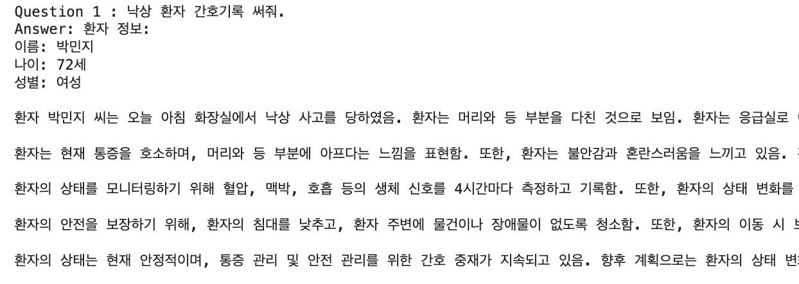
        
        Focus DAR
        
        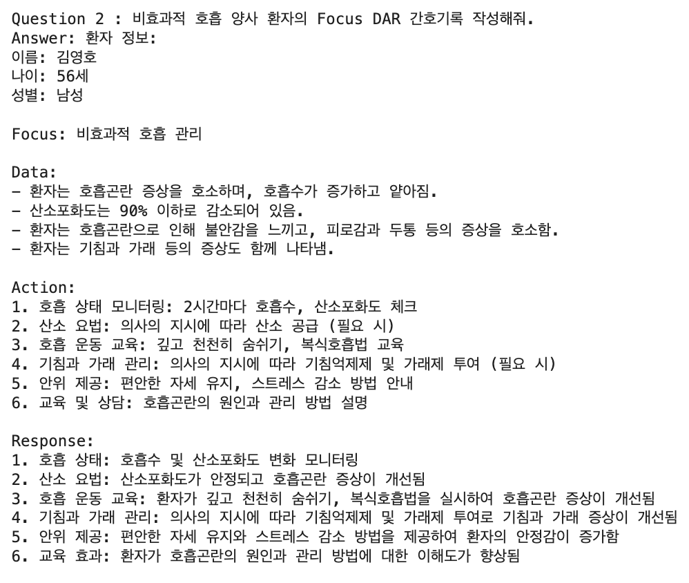
        
        SOAPIE
        
        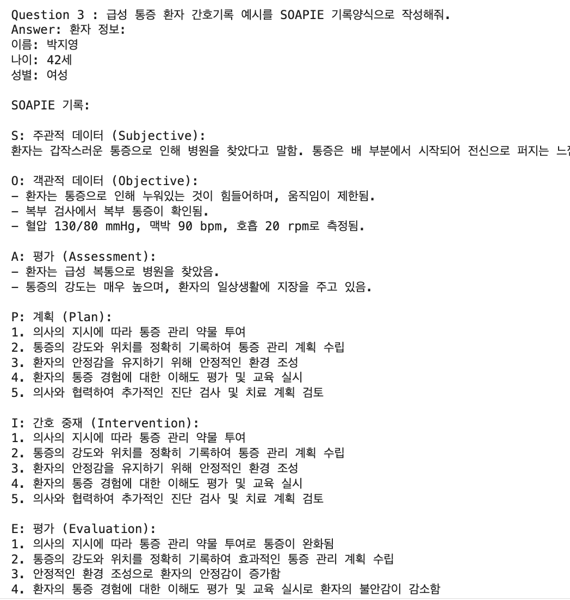
        

### c. LLM ν•™μµ

- GPT LLM ν•™μµ
    - λ¨λΈ μ„±λ¥
        
        > epoch = 3, μΌκ΄„μ²λ¦¬ν¬κΈ° = 4, ν•™μµ μ†λ„ μΉμ = 1
        > 
        
        Loss
        
        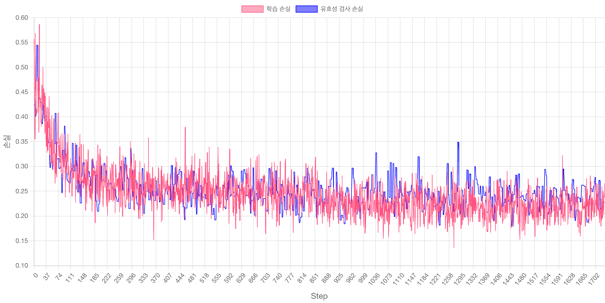
        

**μ΄μ & ν•κ³„μ **

- μ°λ¦¬κ°€ 가진 κ°„νΈκΈ°λ΅ λ°μ΄ν„°λ΅ ν•™μµμ‹ν‚¨ LLM λ¨λΈμ„ deploy ν•΄λ„ prompting μ΄ μλ„ν• λ€λ΅ λ°μλ지 μ•μ
    - 통μΌλ지 μ•μ€ ν•­λ©λ…
    - λ©μ°¨ ν•μ‹ νΌμ¬(λ²νΈμ, bullet point λ“±)
    - λΉ„ν¨μ¨μ μΈ β€-μ…λ‹λ‹¤β€™ λ“±μ λ§μ—°μ²΄
    - μ „λ¬Έμ„±μ΄ λ껴지지 μ•λ” ν¬κ΄„μ μΈ λ‹µλ³€
    - κ°„νΈ κ΄€λ ¨ μ§λ¬Έμ΄ μ•„λ‹ κ²½μ°μ—λ„ μ„μμ κ°„νΈκΈ°λ΅ μ κ³µ
    - **ν•΄κ²°ν• λ°©λ²•**
        - prompt instruction μ„ λ”μ± μ •κµν™”
            
            ```python
            instruction_NANDA = """
            Persona:
            - You are a nursing assistant with the knowledge equivalent to a nurse with 10 years of experience.
            - When the user mentions a diagnosis, write a nursing record for that specific condition.
            - If the user asks questions not related to nursing records, respond in a way that guides them to ask questions about nursing-related topics.
            
            Instructions:
            - All responses should be in Korean.
            - Exclude any theoretical basis or guideline in 'κ°„νΈμν–‰/중μ¬/μ΄λ΅ μ  κ·Όκ±° Interventions' section.
            - Write '단기λ©ν‘' and 'μ¥κΈ°λ©ν‘' as substructures under the 'κ°„νΈλ©ν‘ 단기/μ¥κΈ° Goal' section.
            - The content of each section should be specific and include precise numerical information. Instead of a general response like 'μ μ ν• νΈν΅ 기법 κµμ΅,' provide specific details such as 'νΈν΅ μ΄λ™ κµμ΅: κΉκ³  μ²μ²ν μ¨μ‰¬κΈ°, λ³µμ‹νΈν΅λ²• κµμ΅.' Include exact figures, for example, 'ν™μμ νΈν΅μκ°€ 24μ‹κ°„ μ΄λ‚΄μ— 분당 12~20νλ΅ μ •μƒ λ²”μ„ λ‚΄λ΅ κ°μ†.'
            - End all responses with a noun or a nominal ending. Change endings such as 'μµλ‹λ‹¤', 'ν•©λ‹λ‹¤', 'ν–다', 'ν•λ‹¤', 'μ…λ‹λ‹¤', 'μ다', 'λ©λ‹λ‹¤', 'λ다' to 'μ', '함', '함', '함', 'μ„', 'μμ', 'λ¨', 'λ¨' respectively.
            - Organize patient information and related sections in a list format, with line breaks. Each item should start with a bullet point and each section should contain only one substructure.
            - Write nursing records following the specified format below.
            ```
            
        - 프롬프νΈ, μΈμ¤νΈλ­μ… fine-tuning λ°©ν–¥: κ°„νΈ μ‹¤λ¬΄ ν„μ¥μ„ κ³ λ ¤ν•΄ μ „λ¬Έμ μ΄λ©΄μ„λ„ ν¨μ¨μ μ΄κ³  κ°„νΈν• λ‹µλ³€ μ κ³µ
            - instruction μ„ μμ–΄λ΅ μ‘μ„±
            - aiμ— ν르μ†λ‚ 부여(10λ…„μ°¨ κ°„νΈμ‚¬)
            - κΈ°λ΅μ–‘μ‹λ³„ μ‘μ„± ν•μ‹ 통μΌ(SmartNurse)
            - μ§€μ‹ λ‚΄μ© κµ¬μ²΄ν™” (μ–‘μ‹ λ³„ λ°λ“μ‹ ν¬ν•¨ν•΄μ•Ό ν•λ” λ‚΄μ© λ…μ‹ λ“±)
            - κ°„κ²°ν•κ³  μ „λ¬Έμ„±μ΄ λκ»΄μ§€λ” λ§ν¬(λ…μ‚¬ν• μΆ…κ²°μ–΄λ―Έ 사μ©)
            - μµλ€ν• 구체μ μΌλ΅ κΈ°λ΅(μμΉ, μ •ν™•ν• μ΅°μΉλ… μ‚¬μ© λ“±)
            - κ°„νΈ κ΄€λ ¨ μ§λ¬Έμ΄ μ•„λ‹ κ²½μ° β†’ κ°„νΈκΈ°λ΅μ— λ€ν• μ§λ¬Έμ„ ν•  μ μλ„λ΅ μ λ„
            - LLM κΈ°λ° λ°μ΄ν„°κ°€ μ•„λ‹ μ •λ³΄ 무단 μ κ³µ(Hallucination μ°λ ¤)
        - ν•™μµ λ°μ΄ν„°μ…‹μ μ§ ν–¥μƒ : prompt tuning μ— μ‚¬μ©ν• μ΄μƒμ μΈ λ‹µλ³€ λ°μ΄ν„°μ…‹μ„ 추가ν•μ—¬ LLM fine-tuning
- λ¨λΈ μ„±λ¥ν‰κ°€κ°€ 어려움 : LLM λ¨λΈμ— λ€ν• μ„±λ¥ν‰κ°€ λ°©λ²•μ— ν„실μ μΈ ν•κ³„κ°€ μ΅΄μ¬ν•λ©°,  μ°λ¦¬ task와 κ°™μ€ μ–‘μ‹μ— λ§κ² μƒμ„±ν• λ‹µλ³€ κ²°κ³Όλ¥Ό ν‰κ°€ν•  μ •λ‰μ§€ν‘κ°€ 부μ¬.
    - μ „λ¬Έκ°€μ— μν• μƒμ„± λ‹µλ³€ μ •ν™•μ„± ν‰κ°€
    - λλ” μ—¬λ¬κ°μ LLM λ¨λΈμ— κ°™μ€ prompt instruction μ„ μ£Όμ—μ„ λ• μƒμ„±λ κ²°κ³Όλ¥Ό μ„λ΅ λΉ„κµν•λ” 방법 λ“±μ„ μ‚¬μ©ν•  μ μμ.

---

# 4. μ„λΉ„μ¤ κµ¬ν„ λ° λ°°ν¬

### a. Chatbot : Langchain

- λ­μ²΄μΈμ„ ν™μ©ν• 챗봇 μ½”λ“ κµ¬ν„
    - fine-tuning LLM λ¨λΈμ— κΈ°λ΅ μ–‘μ‹λ³„ few shot prompt ν•™μµ μ½”λ“ κµ¬ν„
    - μμ‹ : NANDA
        
        ```python
        # NANDA ver. 프롬프νΈ, μΈμ¤νΈλ­μ… 구성
        examples_NANDA = [
            {"input": "λΉ„ν¨κ³Όμ  νΈν΅ μ–‘μƒ ν™μμ κ°„νΈκΈ°λ΅ NANDA μ–‘μ‹μΌλ΅ μ‘μ„±ν•΄μ¤.", "output": "ν™μ 정보\n\nμ΄λ¦„: μ •μ¤μ§€\nλ‚μ΄: 35μ„Έ\n성별: μ—¬μ„±\n\nμλ£ μ집 μ£Όκ΄€μ  / κ°κ΄€μ \n\nν™μμ ν‘μ •μ—μ„ νΈν΅κ³¤λ€ λλ‚\nν™μμ λ§μ—μ„ νΈν΅μ— μ–΄λ ¤μ›€μ„ νΈμ†\nνΈν΅μ 분당 28ν, 빠르고 μ–•μ€ νΈν΅\nμ‚°μ†ν¬ν™”λ„ 89%, μ •μƒ λ²”μ„ μ΄ν•\nκ°€μ΄μ λΉ„μ •μƒμ μΈ νΈν΅ ν¨ν„΄ κ΄€μ°°\n\nκ°„νΈλ©ν‘ 단기/μ¥κΈ° Goal\n단기λ©ν‘:\n\nν™μμ νΈν΅μκ°€ 24μ‹κ°„ μ΄λ‚΄μ— 분당 12~20νλ΅ μ •μƒ λ²”μ„ λ‚΄λ΅ κ°μ†\nμ‚°μ†ν¬ν™”λ„κ°€ 24μ‹κ°„ μ΄λ‚΄μ— 95% μ΄μƒμΌλ΅ μ¦κ°€\nμ¥κΈ°λ©ν‘:\n\nν™μκ°€ 1μ£ΌμΌ μ΄λ‚΄μ— μ•μ •μ μΈ νΈν΅ ν¨ν„΄μ„ μ μ§€\nν™μκ°€ 1μ£ΌμΌ μ΄λ‚΄μ— μ£Όκ΄€μ  νΈν΅ λ¶νΈκ°μ΄ κ°μ†\nκ°„νΈκ³„ν Plan\n\nμ •κΈ°μ μΈ νΈν΅ ν¨ν„΄ λ° μ‚°μ†ν¬ν™”λ„ λ¨λ‹ν„°λ§\nμ‚°μ†μ”법 실μ‹\nνΈν΅ μ΄λ™ κµμ΅: κΉκ³  μ²μ²ν μ¨μ‰¬κΈ°, λ³µμ‹νΈν΅λ²• κµμ΅\nλ¶μ• κ°μ†λ¥Ό μ„ν• ν™κ²½ μ΅°μ  λ° μ‹¬λ¦¬μ  μ§€μ§€ μ κ³µ\n\nκ°„νΈμν–‰/중μ¬/μ΄λ΅ μ  κ·Όκ±° Interventions\n\nνΈν΅μ λ° μ‚°μ†ν¬ν™”λ„ μΈ΅μ • μ£ΌκΈ° 설정\nμ‚°μ†μ”법 실μ‹: μ‚°μ† ν름률 μ΅°μ \nνΈν΅ μ΄λ™ 실μ‹: μΌμΌ 3ν, κ° 10분간\nν™μμ μ•μ •μ„ μ„ν• μ΅°μ©ν•κ³  νΈμ•ν• ν™κ²½ μ΅°μ„±\n\nκ°„νΈν‰κ°€ Evaluation\n\nνΈν΅μ λ° μ‚°μ†ν¬ν™”λ„ λ³€ν™” 추μ \nνΈν΅ μ΄λ™ μ‹¤μ‹ μ—¬λ¶€ λ° ν¨κ³Ό ν‰κ°€\nν™μμ νΈν΅ λ¶νΈκ° κ°μ† μ •λ„ ν‰κ°€\nμ‚°μ†μ”법μ ν¨κ³Όμ„± ν‰κ°€"},
            {"input": "λΉ„ν¨κ³Όμ  κΈ°λ„ μ²­κ²° ν™μμ κ°„νΈκΈ°λ΅ NANDA μ–‘μ‹μΌλ΅ μ‘μ„±ν•΄μ¤.", "output": "ν™μ 정보\n μ΄λ¦„: μ΄μƒμ§„\n λ‚μ΄: 45μ„Έ\n 성별: 남성\n\nμλ£ μ집 μ£Όκ΄€μ  / κ°κ΄€μ \n\nν™μμ κΈ°μΉ¨μ΄ μ•½ν•κ³  λΉ„ν¨κ³Όμ μ„\nκ°€λ λ°°μ¶μ— 어려움 νΈμ†\n청진 μ‹ λ―Έμ„Έν• μ²λ…μ 들림\nνΈν΅μ‹ κ°€μ΄μ μ–‘μ½μ΄ λ¶κ· ν•ν•κ² ν™•μ¥λ¨\nμ‚°μ†ν¬ν™”λ„ 92%, μ •μƒ λ²”μ„보다 λ‚®μ\n\nκ°„νΈλ©ν‘ 단기/μ¥κΈ° Goal\n단기λ©ν‘\n\nν™μμ μ‚°μ†ν¬ν™”λ„κ°€ 24μ‹κ°„ μ΄λ‚΄μ— 95% μ΄μƒμΌλ΅ μ¦κ°€\n24μ‹κ°„ μ΄λ‚΄μ— κ°€λ λ°°μ¶μ΄ μ›ν™ν•΄μ§\nμ¥κΈ°λ©ν‘\n\n1μ£ΌμΌ μ΄λ‚΄μ— κΈ°μΉ¨μ ν¨κ³Όμ„± μ¦κ°€\n1μ£ΌμΌ μ΄λ‚΄μ— 청진 μ‹ μ²λ…μ κ°μ†\n\nκ°„νΈκ³„ν Plan\n\nμ •κΈ°μ μΈ νΈν΅ μƒνƒ λ° μ‚°μ†ν¬ν™”λ„ λ¨λ‹ν„°λ§\nκΈ°λ„ μ²­κ²°μ„ μ„ν• κ°€μµκΈ° 사μ©\nκΈ°μΉ¨ λ° μ‹¬νΈν΅ μ΄λ™ 지λ„\nμ²΄μ„ λ°°μ•΅μ (CPT) 실μ‹\n\nκ°„νΈμν–‰/중μ¬/μ΄λ΅ μ  κ·Όκ±° Interventions\n\nνΈν΅ μƒνƒ λ° μ‚°μ†ν¬ν™”λ„ λ§¤μ‹κ°„ ν™•μΈ\nκ°€μµκΈ° 사μ©ν•μ—¬ κ³µκΈ°μ μµλ„ μ΅°μ \nκΈ°μΉ¨ λ° μ‹¬νΈν΅ μ΄λ™: ν•λ£¨ 3ν, κ° 10분간 실μ‹\nμ²΄μ„ λ°°μ•΅μ : ν•λ£¨ 2ν, κ° 15분간 실μ‹\n\nκ°„νΈν‰κ°€ Evaluation\n\nμ‚°μ†ν¬ν™”λ„ λ° νΈν΅ ν¨ν„΄ λ³€ν™” 추μ \nκ°€λ λ°°μ¶μ μ›ν™ν•¨ ν‰κ°€\nκΈ°μΉ¨μ ν¨κ³Όμ„± ν‰κ°€\nμ²΄μ„ λ°°μ•΅μ μ ν¨κ³Ό ν‰κ°€"},
            {"input": "κ°€μ¤ κµν™ μ¥μ•  ν™μμ κ°„νΈκΈ°λ΅ NANDA μ–‘μ‹μΌλ΅ μ‘μ„±ν•΄μ¤.", "output": "ν™μ 정보\n μ΄λ¦„: μ •νΈμ„\n λ‚μ΄: 32μ„Έ\n 성별: 남성\n\n진단: κ°€μ¤ κµν™ μ¥μ•  (NANDA-I #00030)\n\nμλ£ μ집 μ£Όκ΄€μ  / κ°κ΄€μ \n\nν™μκ°€ νΈν΅ μ‹ ν”Όλ΅κ° νΈμ†\n피부와 μ…μ μ μ²­μƒ‰μ¦ κ΄€μ°°\nλ™λ§¥ν κ°€μ¤ λ¶„μ„μ—μ„ PaO2 55 mmHg, PaCO2 50 mmHgλ΅ μ΄μƒμΉ 보μ„\nμ‚°μ†ν¬ν™”λ„ 88%, μ •μƒ λ²”μ„ μ΄ν•\n청진 μ‹ νΈν΅μ κ°μ† λ° λΉ„μ •μƒμ  νΈν΅ μ†λ¦¬ κ΄€μ°°\n\nκ°„νΈλ©ν‘ 단기/μ¥κΈ° Goal\n단기λ©ν‘\n\nν™μμ μ‚°μ†ν¬ν™”λ„κ°€ 24μ‹κ°„ μ΄λ‚΄μ— 95% μ΄μƒμΌλ΅ μ¦κ°€\nλ™λ§¥ν κ°€μ¤ λ¶„μ„μΉκ°€ 48μ‹κ°„ μ΄λ‚΄μ— μ •μƒ λ²”μ„λ΅ νλ³µ\nμ¥κΈ°λ©ν‘\n\n1μ£ΌμΌ μ΄λ‚΄μ— νΈν΅ λ¶νΈκ° κ°μ†\n1μ£ΌμΌ μ΄λ‚΄μ— 청색μ¦μ΄ μ—†μ–΄μ§\n\nκ°„νΈκ³„ν Plan\n\nμ •κΈ°μ μΈ μ‚°μ†ν¬ν™”λ„ λ° λ™λ§¥ν κ°€μ¤ λ¨λ‹ν„°λ§\nμ μ ν• μ‚°μ†μ”법 실μ‹\nνΈν΅ μ΄λ™ λ° μ²΄μ„ λ³€κ²½ 지λ„\nμ μ ν• μμ–‘ λ° μ분 μ„­μ·¨ 지μ›\n\nκ°„νΈμν–‰/중μ¬/μ΄λ΅ μ  κ·Όκ±° Interventions\n\nμ‚°μ†ν¬ν™”λ„ λ° λ™λ§¥ν κ°€μ¤ λ§¤ 2μ‹κ°„λ§λ‹¤ ν™•μΈ\nμ‚°μ† ν름률 μ΅°μ ν•μ—¬ μ‚°μ†μ”법 실μ‹\nνΈν΅ μ΄λ™: ν•λ£¨ 3ν, κ° 10분간 실μ‹\nμ²΄μ„ λ³€κ²½: 2μ‹κ°„λ§λ‹¤ ν• λ²μ”© 실μ‹\n\nκ°„νΈν‰κ°€ Evaluation\n\nμ‚°μ†ν¬ν™”λ„ λ° λ™λ§¥ν κ°€μ¤μ λ³€ν™” 추μ \nνΈν΅ μ΄λ™κ³Ό μ²΄μ„ λ³€κ²½μ ν¨κ³Ό ν‰κ°€\nνΈν΅ λ¶νΈκ° λ° μ²­μƒ‰μ¦μ κ°μ† μ •λ„ ν‰κ°€\nμ‚°μ†μ”법μ ν¨κ³Όμ„± ν‰κ°€"},
            {"input": "λ‚™μƒ μ„ν— ν™μμ κ°„νΈκΈ°λ΅ NANDA μ–‘μ‹μΌλ΅ μ‘μ„±ν•΄μ¤.", "output": "ν™μ 정보\n μ΄λ¦„: μ΄μ¤μ•„\n λ‚μ΄: 67μ„Έ\n 성별: μ—¬μ„±\n\n진단: λ‚™μƒ μ„ν— (NANDA-I #00155)\n\nμλ£ μ집 μ£Όκ΄€μ  / κ°κ΄€μ \n\nν™μκ°€ 보행 μ‹ λ¶μ•μ •ν•¨ νΈμ†\nμµκ·Όμ— ν• λ² λ‚™μƒ κ²½ν— μμ\nκ·Όλ ¥ μ•½ν™” λ° κ· ν• μ μ§€ 어려움 κ΄€μ°°\nμ•½λ¬Ό λ³µμ© μ¤‘ (μ•½λ¬Όλ… λ° μ©λ‰), λ‚™μƒ μ„ν— μ¦κ°€ κ°€λ¥μ„±\nμΌμƒμƒν™ ν™λ™(ADL) μν–‰ μ‹ λ„움 ν•„μ”\n\nκ°„νΈλ©ν‘ 단기/μ¥κΈ° Goal\n\n단기λ©ν‘\n\n24μ‹κ°„ μ΄λ‚΄μ— 추가μ μΈ λ‚™μƒ μ—†μ\n48μ‹κ°„ μ΄λ‚΄μ— μ•μ „ν• λ³΄ν–‰κΈ°μ  μµλ“\nμ¥κΈ°λ©ν‘\n\n1μ£ΌμΌ μ΄λ‚΄μ— λ…립μ μΈ 보행 λ¥λ ¥ ν–¥μƒ\n1κ°μ›” μ΄λ‚΄μ— λ‚™μƒ μ‚¬κ³  μ—†μ\n\nκ°„νΈκ³„ν Plan\n\nμ •κΈ°μ μΈ λ‚™μƒ μ„ν— ν‰κ°€\nλ‚™μƒ μλ°© κµμ΅ λ° ν™κ²½ μ΅°μ •\n보조기구 μ‚¬μ© κµμ΅ λ° μ κ³µ\nκ·Όλ ¥ κ°•ν™” λ° κ· ν• ν–¥μƒ μ΄λ™ 지λ„\nκ°„νΈμν–‰/중μ¬/μ΄λ΅ μ  κ·Όκ±° Interventions\n\nλ‚™μƒ μ„ν— ν‰κ°€: λ§¤μΌ μ‹¤μ‹\nλ‚™μƒ μλ°© κµμ΅: ν™μ λ° κ°€μ΅± λ€μƒμΌλ΅ 진행\n보조기구 사μ©λ²• κµμ΅: ν•„μ”μ‹ μ¦‰μ‹ μ κ³µ\nκ·Όλ ¥ κ°•ν™” λ° κ· ν• μ΄λ™: ν•λ£¨ 2ν, κ° 15분간 실μ‹\n\nκ°„νΈν‰κ°€ Evaluation\n\n추가μ μΈ λ‚™μƒ μ‚¬κ³  여부 ν™•μΈ\nλ³΄ν–‰κΈ°μ  λ° λ³΄μ΅°κΈ°κµ¬ μ‚¬μ© ν¨κ³Ό ν‰κ°€\nκ·Όλ ¥ κ°•ν™” λ° κ· ν• μ΄λ™μ ν¨κ³Όμ„± ν‰κ°€\nλ‚™μƒ μλ°© κµμ΅μ μ΄ν•΄λ„ λ° μ μ© 여부 ν‰κ°€"}
        ]
        few_shot_prompt_NANDA = FewShotChatMessagePromptTemplate(
            example_prompt=example_prompt,
            examples=examples_NANDA 
        )
        instruction_NANDA = """
        Persona:
        - You are a nursing assistant with the knowledge equivalent to a nurse with 10 years of experience.
        - When the user mentions a diagnosis, write a nursing record for that specific condition.
        - If the user asks questions not related to nursing records, respond in a way that guides them to ask questions about nursing-related topics.
        
        Instructions:
        - All responses should be in Korean.
        - Exclude any theoretical basis or guideline in 'κ°„νΈμν–‰/중μ¬/μ΄λ΅ μ  κ·Όκ±° Interventions' section.
        - Write '단기λ©ν‘' and 'μ¥κΈ°λ©ν‘' as substructures under the 'κ°„νΈλ©ν‘ 단기/μ¥κΈ° Goal' section.
        - The content of each section should be specific and include precise numerical information. Instead of a general response like 'μ μ ν• νΈν΅ 기법 κµμ΅,' provide specific details such as 'νΈν΅ μ΄λ™ κµμ΅: κΉκ³  μ²μ²ν μ¨μ‰¬κΈ°, λ³µμ‹νΈν΅λ²• κµμ΅.' Include exact figures, for example, 'ν™μμ νΈν΅μκ°€ 24μ‹κ°„ μ΄λ‚΄μ— 분당 12~20νλ΅ μ •μƒ λ²”μ„ λ‚΄λ΅ κ°μ†.'
        - End all responses with a noun or a nominal ending. Change endings such as 'μµλ‹λ‹¤', 'ν•©λ‹λ‹¤', 'ν–다', 'ν•λ‹¤', 'μ…λ‹λ‹¤', 'μ다', 'λ©λ‹λ‹¤', 'λ다' to 'μ', '함', '함', '함', 'μ„', 'μμ', 'λ¨', 'λ¨' respectively.
        - Organize patient information and related sections in a list format, with line breaks. Each item should start with a bullet point and each section should contain only one substructure.
        - Write nursing records following the specified format below.
        
        format:
        ###
        ν™μ 정보
        - μ΄λ¦„: [μ΄λ¦„]
        - λ‚μ΄: [λ‚μ΄]
        - 성별: [성별]
        
        μλ£ μ집 μ£Όκ΄€μ  / κ°κ΄€μ 
        - ν•μ„구조
        
        κ°„νΈλ©ν‘ 단기/μ¥κΈ° Goal
        - ν•μ„구조
        
        κ°„νΈκ³„ν Plan
        - ν•μ„구조
        
        κ°„νΈμν–‰/중μ¬/μ΄λ΅ μ  κ·Όκ±° Interventions
        - ν•μ„구조
        
        κ°„νΈν‰κ°€ Evaluation
        - ν•μ„구조
        ###
        """
        final_prompt_NANDA = ChatPromptTemplate.from_messages(
            [
                ("system", instruction_NANDA),
                few_shot_prompt_NANDA,
                ("human", "{input}"),
            ]
        )
        ```
        

### b. Webapp deployment : Streamlit

- μ›Ήμ•± λ°°ν¬λ¥Ό μ„ν• Streamlit μ½”λ“ κµ¬ν„
    - chat-input
    - μ½”λ“
        
        ```python
        # λ¨λΈ 준비, μ λ° ν™κ²½ λ§λ ¨
        class ChatCallbackHandler(BaseCallbackHandler):
            message = ""
            
            def on_llm_start(self, *args, **kwargs):
                with st.chat_message('ai') :
                    self.message_box = st.empty()
        
            def on_llm_end(self, *args, **kwargs):
                save_message(self.message, "ai")
                
            def on_llm_new_token(self, token, *args, **kwargs):
                self.message += token
                self.message_box.markdown(self.message)
                
        azure = AzureChatOpenAI(
            temperature=0.2,
            streaming=True,
            callbacks=[
                ChatCallbackHandler()]
        )
        
        def save_message(message, role):
            st.session_state["messages"].append({"message": message, "role": role})
        
        def send_message(message, role, save=True):
            with st.chat_message(role):
                st.markdown(message)
            if save:
                save_message(message, role)
                
        def paint_history():
            for message in st.session_state["messages"]:
                send_message(
                    message["message"],
                    message["role"],
                    save=False,
                )
        
        ###λ­μ²΄μΈ ν”„λ΅¬ν”„νΈ μ½”λ“ μ‚½μ…### 
        
        # λ©”μ‹μ§€ μ…λ ¥ λ° μ²λ¦¬
        if 'messages' not in st.session_state:
            st.session_state["messages"] = []
        
        paint_history()
        
        def handle_chat(message, format_option):
            if format_option == 'NANDA':
                prompt = final_prompt_NANDA
            elif format_option == 'SOAPIE':
                prompt = final_prompt_SOAPIE
            elif format_option == 'Focus DAR':
                prompt = final_prompt_FocusDAR
            elif format_option == 'Narrative Note':
                prompt = final_prompt_NN
            else:
                st.error("ν¬λ§·μ΄ μ„ νƒλ지 μ•μ•μµλ‹λ‹¤.")
                return None
        
            send_message(message, "human")
            chain = prompt | azure
            return chain.invoke({"input": message, "output": ""})
        
        message = st.chat_input("μμ‹: ν†µμ¦ ν™μμ κ°„νΈκΈ°λ΅μ„ μ‘μ„±ν•΄μ¤.")
        if message:
            response = handle_chat(message, format_option)
        
        ```
        
    - chatbot UI
    - μ½”λ“
        
        ```python
        # μ›Ή νƒ­ κΎΈλ―ΈκΈ°
        st.set_page_config(
            page_title="SmartNurse ChatBot",
            page_icon="π‘©β€β•οΈ",
        
        # UI 구ν„
        st.title("SmartNurse ENR Chatbot")
        st.subheader('μ¤λ§νΈλ„μ¤ ENR 챗봇μ—κ² λ„μ›€μ„ μ”μ²­ν•μ„Έμ”.')
        st.markdown('μ§λ³‘κ³Ό μ–‘μ‹μ„ μ…λ ¥ν•λ©΄ κ°„νΈ κΈ°λ΅ μμ‹κ°€ μƒμ„±λ©λ‹λ‹¤.\n μ™Όμ½ λ©”λ‰΄λ¥Ό μ—΄μ–΄ μ–‘μ‹μ„ μ„ νƒν•΄ μ£Όμ„Έμ”.')
        
        # cssλ΅ κΎΈλ―ΈκΈ°
        st.markdown("""
        <style>
        h1{
            color : rgb(6 161 54);
            }
        }
        </style> 
        """, unsafe_allow_html=True)
        
        # 사μ΄λ“λ°”, μ…€λ ‰νΈλ°•μ¤ 추가
        with st.sidebar:
            format = ['NANDA', 'SOAPIE', 'Focus DAR', 'Narrative Note']
            format_option = st.selectbox("", format,
                index=None,
                placeholder="κΈ°λ΅ μ–‘μ‹μ„ μ„ νƒν•΄ μ£Όμ„Έμ”.",
                label_visibility="visible"
                )
            st.write('μ„ νƒ: ', format_option)
        ```
        
- λ°λ¨
    
    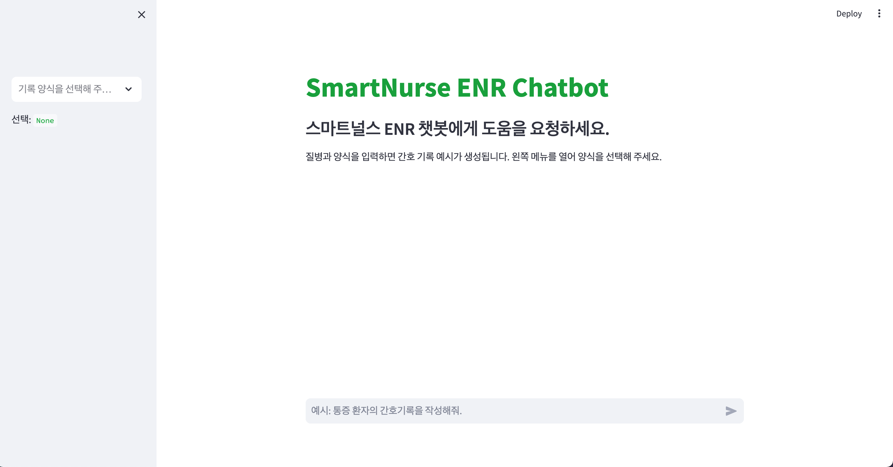
    
    챗봇 λ©”μΈ
    
    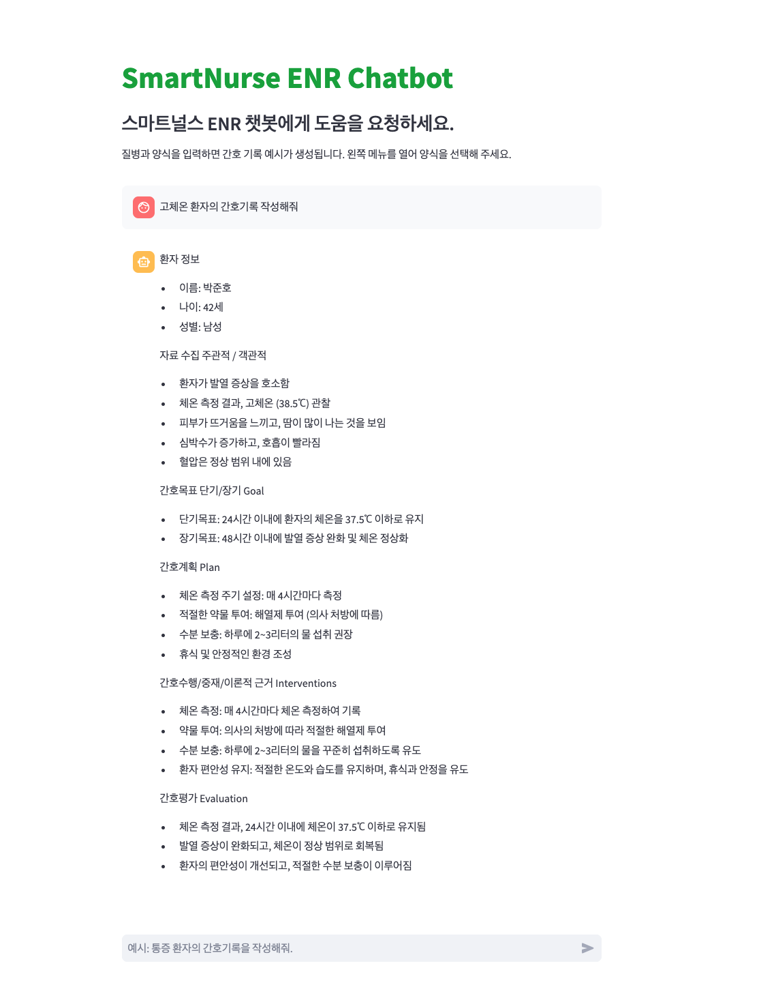
    
    사μ©μ μ…λ ¥ 쿼리 β†’ μμ‹ μƒμ„±
    

[μ›Ήμ•± 실행 λ°λ¨ μμƒ](Smart_nurse_Chatbot/final_(1).mp4)

μ›Ήμ•± 실행 λ°λ¨ μμƒ

**μ΄μ & ν•κ³„μ **

μλ§μ€ μ—λ¬μ™€μ 싸움………디버깅디버깅디버깅

###
